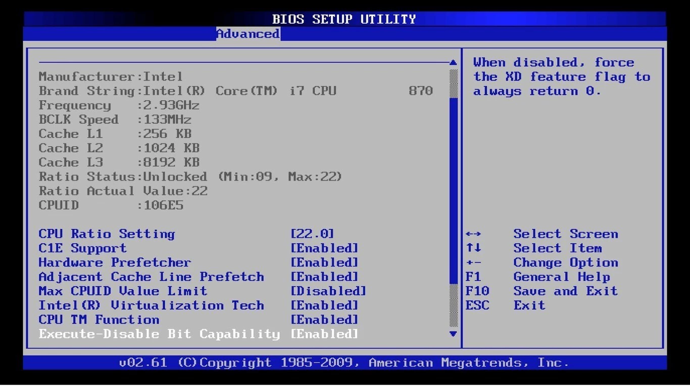
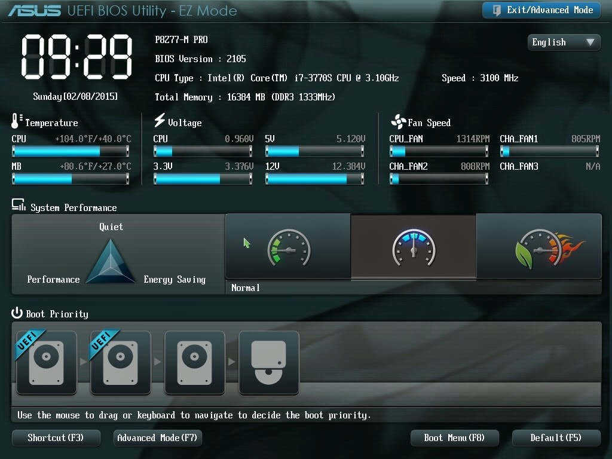
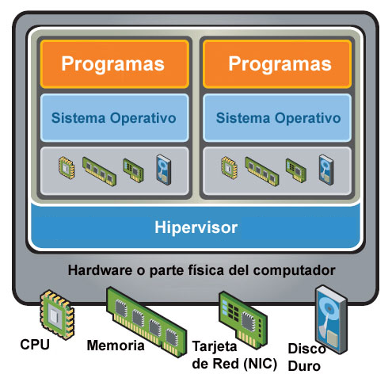
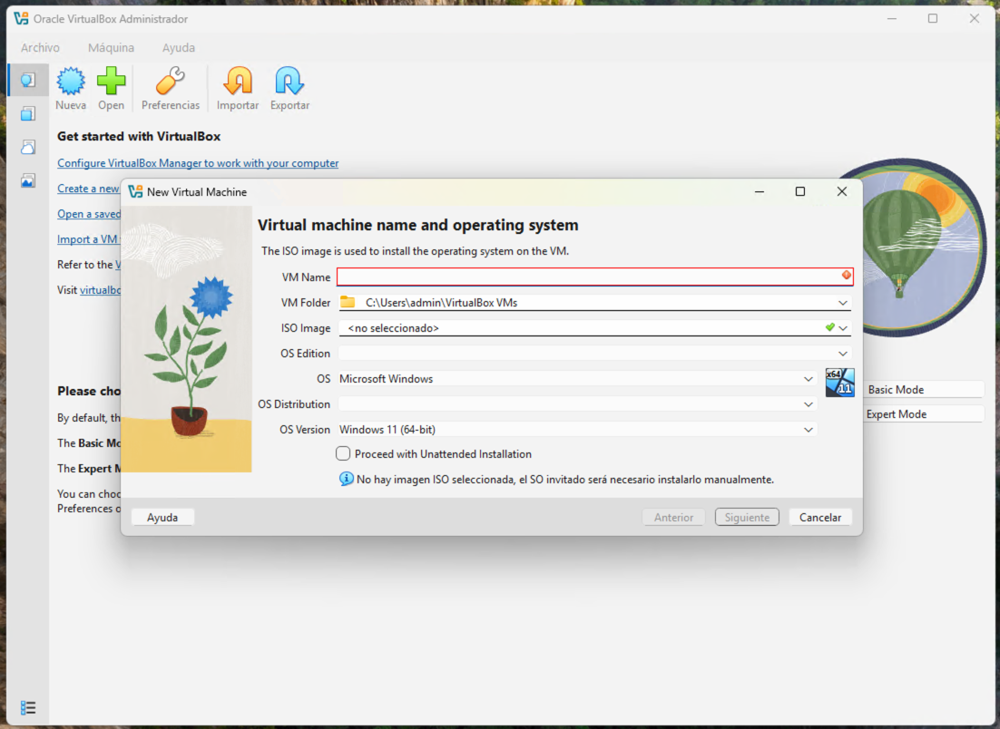

# Unidad 2 - Instalación y máquinas virtuales con Windows y Linux

## Introducción

Antes de que un ordenador pueda ser utilizado, es imprescindible contar con un sistema operativo que actúe como base para la ejecución de programas y aplicaciones. Este componente es el que permite que el hardware y el software trabajen de forma coordinada.

En el mercado existen diversas alternativas, como Windows, macOS o Linux, cada una con diferentes versiones y características. No todas resultan apropiadas para cualquier equipo, por lo que la elección debe hacerse con cuidado. Una selección inadecuada puede ocasionar fallos de funcionamiento o un rendimiento deficiente.

Asimismo, no todas las aplicaciones son compatibles con cualquier sistema operativo, lo que hace necesario valorar qué programas se necesitan y qué hardware está disponible antes de decidir cuál instalar.

## Seleccionar un SO

La decisión sobre qué sistema operativo utilizar no tiene una única respuesta válida, ya que depende de múltiples factores. Antes de elegir conviene plantearse cuestiones como: ¿qué hardware tiene el equipo?, ¿qué programas necesito ejecutar?, ¿qué tipo de interfaz o experiencia de uso prefiero? Una mala elección puede traducirse en problemas de compatibilidad o en un rendimiento inferior al esperado.

Entre los principales aspectos a tener en cuenta destacan:

- **Económicos**: algunos sistemas operativos son de distribución gratuita (como muchas distribuciones de Linux), mientras que otros requieren la compra de una licencia, como Windows o macOS, cuyo coste debe valorarse en relación con los beneficios que ofrecen.
- **Técnicos**: es necesario comprobar que el hardware cumple los requisitos mínimos y recomendados. De no ser así, puede ser necesario optar por una versión más ligera o por una alternativa que aproveche mejor los recursos disponibles.
- **Soporte y actualizaciones**: un buen sistema operativo debe contar con actualizaciones de seguridad frecuentes, mejoras de rendimiento y corrección de errores. Windows 11, macOS Sonoma o distribuciones Linux con soporte extendido (LTS) son ejemplos de sistemas que se mantienen actualizados.
- **Preferencias personales**: la comodidad y la familiaridad también son factores decisivos. Muchos usuarios prefieren seguir utilizando el entorno con el que ya están habituados, aunque cambiar puede ser una opción interesante si la experiencia actual no resulta satisfactoria.

A continuación, se presenta una descripción general de los sistemas operativos más habituales en ordenadores personales.

### Windows

Desde el lanzamiento de su primera versión, Windows ha acumulado más de tres décadas de evolución. Su amplia implantación en ordenadores personales y su facilidad de uso lo han convertido en el sistema operativo más extendido entre los usuarios domésticos y profesionales. A ello se suma una gran cantidad de software disponible y un ecosistema de soporte muy consolidado.

Ventajas principales:

- La mayoría de los usuarios está familiarizada con su entorno.
- Es el sistema con mayor número de programas y aplicaciones desarrollados.
- Su instalación y manejo resultan sencillos.
- Gracias a su popularidad, es fácil encontrar soluciones a problemas técnicos en foros y comunidades.

Inconvenientes:

- Requiere la compra de una licencia, lo que supone un coste elevado en comparación con alternativas gratuitas.
- Las versiones más recientes, como Windows 11, demandan hardware potente y moderno.
- Es más vulnerable a malware y virus, por lo que el uso de un antivirus es prácticamente imprescindible.
- Puede presentar problemas de compatibilidad con aplicaciones antiguas.
- Sin un mantenimiento adecuado, el sistema puede volverse inestable con el tiempo.
- Necesita actualizaciones frecuentes para corregir errores y reforzar la seguridad.

### Linux

Linux surgió a comienzos de los años noventa en el ámbito universitario, inicialmente con fines académicos, y pronto se consolidó como una alternativa real a Windows. Gracias a la colaboración de miles de desarrolladores en todo el mundo, se ha convertido en un sistema en constante evolución, capaz de adaptarse a distintos perfiles de usuarios y necesidades.

Ventajas principales:

- Es gratuito en la mayoría de sus distribuciones y no exige un hardware de alto coste.
- Destaca por su seguridad y estabilidad, lo que lo hace idóneo para servidores, bases de datos o aplicaciones web.
- Puede aprovechar equipos con recursos limitados, siendo adecuado incluso para ordenadores antiguos mediante distribuciones ligeras.
- Ofrece gran cantidad de software libre y gratuito.
- Existen distribuciones adaptadas a distintos usos (educación, seguridad, multimedia, servidores, etc.).
- Las vulnerabilidades suelen resolverse con rapidez gracias al trabajo de la comunidad.
- Su código optimizado favorece un buen rendimiento y eficiencia.
- Es un sistema altamente configurable y flexible.

Inconvenientes:

- En algunas tareas avanzadas requiere conocimientos previos de Unix o administración de sistemas.
- El soporte comercial es más limitado que en otros sistemas operativos.
- Aunque ha crecido mucho el catálogo, aún existen menos programas comerciales disponibles.
- No siempre hay equivalentes directos para determinadas aplicaciones de Windows o macOS.
- Algunos dispositivos de hardware muy recientes pueden carecer de controladores oficiales.
- Aunque distribuciones como Ubuntu o Linux Mint han mejorado la usabilidad, puede resultar más complejo para usuarios sin experiencia, ya que la curva de aprendizaje es mayor.
- Parte de la documentación sigue siendo técnica, lo que puede generar cierta resistencia entre usuarios noveles.

### macOS

Apple concibe sus equipos como un producto integrado de hardware y software, de modo que macOS es el sistema operativo exclusivo de los ordenadores Mac. Esta integración garantiza un alto nivel de optimización y estabilidad, lo que lo convierte en una opción muy valorada en determinados entornos profesionales.

Ventajas principales:

- Su interfaz gráfica está muy cuidada y resulta intuitiva, con gran protagonismo de elementos visuales.
- Es especialmente apreciado en ámbitos como el diseño gráfico, la edición de vídeo y el audio profesional.
- Destaca por su estabilidad y fiabilidad.
- Tiene una baja incidencia de virus y malware en comparación con otros sistemas operativos.

Inconvenientes:

- El precio de los equipos es elevado, aunque el sistema operativo viene incluido.
- Muchas aplicaciones profesionales para macOS tienen un coste superior al de sus equivalentes en otras plataformas.
- En caso de avería, la reparación suele ser más costosa y dependiente del servicio técnico oficial.
- Solo puede instalarse en equipos Apple, ya que no es compatible con ordenadores de otros fabricantes.

## Pasos en la instalación de un SO

Cada sistema operativo está diseñado para funcionar con unas especificaciones mínimas de hardware, como un tipo de procesador determinado, una cantidad básica de memoria RAM o un espacio mínimo en disco. Estos valores aseguran que el sistema pueda ejecutarse, pero no necesariamente que lo haga con un rendimiento fluido.

Por este motivo, además de los requisitos mínimos, la documentación técnica suele indicar los requisitos recomendados, que son los que garantizan una experiencia de uso adecuada y estable. Tomar en cuenta ambos parámetros es fundamental antes de decidir qué sistema operativo instalar en un equipo.

A continuación, se presentarán ejemplos de requisitos mínimos y recomendados de distintos sistemas operativos, considerando aspectos básicos del hardware como procesador, memoria y almacenamiento.

| Sistema operativo        | CPU mínimo / recomendado                   | RAM mínimo / recomendado     | Almacenamiento mínimo / recomendado |
|--------------------------|---------------------------------------------|------------------------------|-------------------------------------|
| **Windows 11**           | 1 GHz, 2 núcleos, 64-bit                   | 4 GB                         | 64 GB                               |
| **Ubuntu LTS (24.04)**   | Doble núcleo ~2 GHz                        | 4 GB / 8 GB recomendado      | 25 GB / 50 GB recomendado           |
| **macOS Sonoma**         | Apple Silicon o Intel 8ª gen en adelante   | 8 GB                         | 25 GB libres                        |

### Copia de seguridad de los datos actuales

Antes de instalar un nuevo sistema operativo es fundamental realizar una copia de seguridad de la información importante, salvo en los casos en que el disco esté vacío y no haya datos que conservar. Si ya existe un sistema operativo instalado, conviene guardar los archivos que se quieran preservar en un medio de almacenamiento externo, como un disco duro externo, una memoria USB o un servicio en la nube, para evitar pérdidas irreversibles durante el proceso.

### Obtener el soporte de instalación

Hoy en día, los sistemas operativos pueden instalarse desde diferentes medios: unidades ópticas, memorias USB o directamente mediante descarga desde Internet.

En el caso de software propietario, es necesario adquirir una copia legal en tiendas especializadas o a través de la web oficial. Por el contrario, si se trata de un sistema operativo libre, suele ser suficiente con descargar la imagen ISO desde la página del proyecto o, en algunos casos, solicitarla en formato físico.

Con un archivo ISO es posible crear un dispositivo USB de arranque que permita la instalación, algo especialmente útil en equipos que no cuentan con lector óptico.

### Preparar el equipo para el arranque desde el soporte de instalación

En la mayoría de los casos, la instalación de un sistema operativo se realiza desde un dispositivo externo, como un DVD o un pendrive USB, que contiene los archivos necesarios para iniciar el proceso. Si la instalación es desde cero, será necesario reiniciar el ordenador e indicar que arranque desde dicho soporte, ya que este viene configurado para iniciar automáticamente la instalación.

Existen dos formas principales de lograrlo:

- **Menú de arranque**: los equipos actuales suelen incluir un menú de arranque rápido que permite elegir el dispositivo desde el que iniciar el sistema. Para acceder a él, se debe pulsar una tecla específica (F2, F8, F10, F12, ESC, entre otras) justo al encender el ordenador. La tecla concreta depende del fabricante y suele indicarse en los primeros mensajes de la BIOS/UEFI que aparecen en pantalla. Una vez dentro, se selecciona el dispositivo que contiene el instalador del sistema operativo.
- **Configuración en la BIOS/UEFI**: si el equipo no dispone de menú de arranque rápido, será necesario entrar en la BIOS/UEFI y modificar el orden de arranque. En la sección correspondiente (habitualmente llamada Boot o Boot Order), se establece como primera opción el dispositivo con el instalador. Tras guardar los cambios, el ordenador se reiniciará iniciando desde el soporte seleccionado.

### Ejecutar el programa de instalación

Una vez realizados los pasos previos y configurado el arranque desde el soporte de instalación, el ordenador iniciará automáticamente el programa de instalación del sistema operativo. Este suele presentarse como un asistente que guía al usuario paso a paso, solicitando la información necesaria según el sistema y la versión seleccionados.

Entre las configuraciones más habituales que se deben indicar se encuentran:

- **Selección de particiones**: se debe elegir la partición del disco en la que se instalará el sistema. Es importante asegurarse de no seleccionar una que contenga información valiosa, ya que será borrada durante el proceso.
- **Creación del usuario administrador**: todo sistema multiusuario requiere una cuenta con privilegios de administración. Generalmente, esta es la primera cuenta que se configura y tendrá a su cargo la gestión inicial del sistema.
- **Selección de software opcional**: algunos instaladores ofrecen la posibilidad de añadir programas adicionales durante la instalación, ya sea mediante una configuración recomendada o a través de una selección personalizada.
- **Parámetros de red**: si el equipo se conectará a Internet o a una red local, es necesario configurar la tarjeta de red. En la mayoría de los casos se emplea DHCP, lo que permite obtener automáticamente la configuración sin intervención. Si se requiere configuración manual, será necesario introducir datos como la dirección IP, la máscara de red, la puerta de enlace y los servidores DNS.

### Instalador del gestor de arranque

Tras copiar los archivos del sistema operativo en el disco, el instalador completa el proceso configurando el gestor de arranque. Este pequeño programa se encarga de iniciar el sistema operativo o, en el caso de tener varios instalados, de permitir al usuario elegir cuál arrancar. En Windows se utiliza Windows Boot Manager, mientras que en la mayoría de distribuciones Linux se emplea GRUB (GRand Unified Bootloader).

Es importante tener en cuenta que la instalación de Windows suele sobrescribir cualquier cargador previo, por lo que en sistemas de arranque dual conviene instalar primero Windows y después Linux.

### Actualizaciones de seguridad

Una vez finalizada la instalación, es muy probable que existan actualizaciones publicadas después de la versión original del sistema. Estas pueden incluir mejoras de seguridad, corrección de fallos y optimización de rendimiento.

Normalmente, los sistemas operativos modernos descargan e instalan estas actualizaciones de manera automática tras el primer arranque. Mantener el sistema actualizado es esencial para protegerlo frente a vulnerabilidades, malware o errores no detectados en la versión inicial.

### Instalación de controladores de dispositivos

Después de instalar el sistema operativo, es posible que algunos componentes de hardware no funcionen correctamente. Para que lo hagan, es necesario instalar sus controladores (drivers), pequeños programas que permiten la comunicación entre el hardware y el sistema operativo.

Aunque muchos sistemas incluyen una base de drivers genéricos, lo más recomendable es instalar los controladores oficiales del fabricante, ya que garantizan un mejor aprovechamiento del dispositivo y ofrecen todas sus funciones.

Los drivers pueden obtenerse de tres maneras principales:

- A través del CD o memoria USB proporcionado con la placa base, que incluye controladores para los componentes integrados.
- Mediante el disco o soporte incluido con el propio dispositivo.
- Descargándolos desde la página web del fabricante, asegurándose de elegir la versión adecuada para el sistema operativo instalado.

En algunos casos, puede ser necesario reiniciar el equipo tras la instalación de un controlador.

### Instalación de aplicaciones

Con el sistema ya operativo y configurado, el siguiente paso es instalar las aplicaciones de usuario necesarias. Cada programa requiere unos requisitos mínimos, entre los que figura el sistema operativo compatible y su versión. Solo cumpliendo esas condiciones podrán instalarse y funcionar correctamente.

## Terminología

En este apartado se abordará el proceso de instalación de Windows 11 y Lubuntu en un PC moderno con UEFI y Secure Boot. Antes de profundizar en la instalación, conviene repasar algunos conceptos clave relacionados con las tecnologías de firmware que los fabricantes de placas base incluyen en sus equipos actuales.

### UEFI (Unified Extensible Firmware Interface)

La UEFI es una interfaz de firmware estándar que sustituye a la tradicional BIOS (Basic Input/Output System). Fue desarrollada por un consorcio de más de 140 empresas tecnológicas, entre ellas Microsoft, con el objetivo de superar las limitaciones de la BIOS clásica y ofrecer una mayor compatibilidad e interoperabilidad.

A diferencia de la BIOS tradicional, UEFI cuenta con un entorno gráfico más avanzado y fácil de usar, soporte multilenguaje y la posibilidad de integrar utilidades adicionales, como herramientas de red o diagnósticos previos al arranque. Podría describirse como una “BIOS moderna” con un diseño más intuitivo y un rendimiento superior.

Ventajas principales de UEFI:

- Refuerza la seguridad frente a ataques de bootkit durante el arranque.
- Reduce los tiempos de inicio y de reanudación desde la hibernación.
- Permite trabajar con discos de gran capacidad, superiores a 2,2 TB.
- Soporta controladores de firmware modernos de 64 bits.
- Mantiene compatibilidad con hardware diseñado para BIOS.
- Incorpora la posibilidad de activar Secure Boot para garantizar un arranque verificado.





### Particionamiento GPT vs MBR

Una de las grandes ventajas de contar con UEFI es la posibilidad de usar el esquema de particionamiento GPT (GUID Partition Table) en lugar del clásico MBR (Master Boot Record).

Limitaciones de MBR:

- Solo admite hasta 4 particiones primarias, o bien 3 primarias y una extendida que contenga múltiples unidades lógicas.
- El tamaño máximo de cada partición es de 2,2 TB, lo que limita la gestión de discos a un máximo de 8,8 TB.

Ventajas de GPT:

- Permite hasta 128 particiones primarias sin necesidad de particiones extendidas.
- Cada partición puede alcanzar un tamaño de hasta 9,3 ZB (zettabytes), una capacidad prácticamente inalcanzable con la tecnología actual.
- Proporciona un arranque más rápido y confiable.

Cuando Windows se instala en modo UEFI, utiliza automáticamente el esquema GPT para gestionar las particiones del disco.

### Secure Boot

Secure Boot es una característica de UEFI incorporada a partir de Windows 8. Su objetivo es proteger la fase de arranque del sistema operativo frente a software malicioso.

Este mecanismo asegura que únicamente se ejecute código firmado y certificado por el fabricante, bloqueando así intentos de infección mediante bootkits o malware que ataque antes de que cargue el sistema.

El principal inconveniente es que si una distribución de Linux no cuenta con la firma digital reconocida por el firmware, el equipo impedirá su instalación. No obstante, muchas distribuciones actuales incluyen soporte para Secure Boot o proporcionan métodos para instalarse en sistemas que lo tienen activado.

## Virtualización

La virtualización es una tecnología que permite crear entornos informáticos simulados que funcionan como si fueran equipos físicos reales. A través de un software especializado, conocido como hipervisor, es posible ejecutar múltiples sistemas operativos y aplicaciones en un mismo ordenador, compartiendo los recursos de hardware (procesador, memoria, almacenamiento, red) de manera controlada y eficiente.

Este enfoque ofrece grandes ventajas: reduce la necesidad de disponer de varios equipos físicos, facilita la realización de pruebas en diferentes sistemas operativos sin alterar el sistema principal y permite optimizar el uso de los recursos disponibles. Además, la virtualización es fundamental en entornos profesionales y educativos, ya que posibilita la creación de laboratorios de prácticas, el despliegue de servidores virtuales y la ejecución de software en plataformas diversas.



### VirtualBox

VirtualBox es una herramienta de virtualización de código abierto desarrollada originalmente por Sun Microsystems y actualmente mantenida por Oracle. Permite ejecutar sistemas operativos completos como máquinas virtuales dentro de otro sistema anfitrión, lo que significa que es posible tener varios entornos diferentes en un mismo ordenador sin necesidad de modificar el disco físico ni afectar al sistema principal.

Su principal uso es crear entornos de prueba y aprendizaje, ya que facilita instalar, configurar y ejecutar sistemas operativos como Windows, Linux o incluso versiones antiguas de macOS en una máquina virtual. Además, ofrece opciones avanzadas como la creación de instantáneas para guardar el estado de una máquina y restaurarlo en cualquier momento, la configuración de redes virtuales o la integración entre el sistema anfitrión y el invitado para compartir carpetas, portapapeles y dispositivos USB.

Gracias a su versatilidad y facilidad de uso, VirtualBox es una de las soluciones más utilizadas en educación, pruebas de software y entornos de desarrollo.

Puedes descargar VirtualBox en el siguiente [enlace](https://www.virtualbox.org/wiki/Downloads).

#### Crear una máquina virtual

Para comenzar a trabajar con VirtualBox, el primer paso es crear una máquina virtual que actuará como el entorno en el que instalaremos el sistema operativo invitado. El proceso básico es el siguiente:

1. Abrir VirtualBox y hacer clic en el botón Nueva para iniciar el asistente de creación.
2. Introducir un nombre para la máquina virtual y seleccionar el tipo y la versión del sistema operativo que se instalará. Luego, hacer clic en Siguiente.
3. Definir la cantidad de memoria RAM (en MB) que se asignará a la máquina virtual y continuar con Siguiente.
4. Si ya se dispone de un disco virtual creado, elegir la opción Usar un disco duro virtual existente, localizar el archivo correspondiente y hacer clic en Siguiente.
5. Si no existe un disco, seleccionar la opción Crear un disco duro virtual ahora y pulsar Crear.
6. En el asistente de creación de disco, mantener seleccionado el tipo VDI (VirtualBox Disk Image) y hacer clic en Siguiente.
7. Elegir el tipo de almacenamiento: dinámico (ocupa menos espacio inicialmente pero puede crecer) o tamaño fijo (más rápido pero reserva todo el espacio desde el principio). Pulsar Siguiente.
8. Establecer la ubicación y el tamaño del disco virtual. Finalmente, hacer clic en Crear para completar la configuración.



Con estos pasos, la máquina virtual queda lista para proceder a la instalación del sistema operativo invitado.

#### Modificar la configuración de la máquina virtual

Después de crear una máquina virtual en VirtualBox, es recomendable ajustar su configuración para optimizar el rendimiento y facilitar la interacción con el sistema anfitrión. Los pasos más habituales son los siguientes:

1. Seleccionar la máquina virtual en el administrador de VirtualBox y hacer clic en Configuración.
2. En General → Avanzado, activar la opción Compartir portapapeles en modo Bidireccional para poder copiar y pegar entre el sistema anfitrión y el invitado.
3. En Sistema → Placa base, modificar el orden de arranque, desactivando el disquete, situando el disco duro como primera opción y dejando en tercer lugar la unidad de disquete si fuera necesario.
4. En Pantalla → Pantalla, asignar el máximo de memoria de vídeo disponible para mejorar el rendimiento gráfico.
5. En Almacenamiento, seleccionar la unidad óptica dentro del árbol de dispositivos y cargar el archivo ISO del sistema operativo que se instalará.
6. En Red → Adaptador 1, habilitar el adaptador de red y seleccionar el modo de conexión más adecuado (por ejemplo, NAT o puente).
7. En Carpetas compartidas, añadir una carpeta del sistema anfitrión para compartirla con la máquina virtual.
8. Guardar los cambios haciendo clic en Aceptar.

Con esta configuración, la máquina virtual estará lista para iniciar la instalación del sistema operativo invitado de forma más cómoda y eficiente.

#### Instalar el sistema operativo invitado

Una vez configurada la máquina virtual, el siguiente paso es instalar el sistema operativo elegido:

1. En el administrador de VirtualBox, seleccionar la máquina creada y hacer clic en Iniciar.
2. La máquina arrancará desde el archivo ISO previamente configurado y se abrirá el asistente de instalación del sistema operativo.
3. Seguir los pasos indicados por el instalador hasta completar el proceso.

#### Instalar las Guest Additions

Las Guest Additions son un conjunto de controladores y utilidades que mejoran la integración entre el sistema anfitrión y el invitado, permitiendo funciones como pantalla completa, carpetas compartidas, sincronización del portapapeles o mejor soporte gráfico.

En sistemas Windows:
	
1. En el menú de la ventana de la máquina virtual, ir a Dispositivos → Insertar imagen de CD de las Guest Additions.
2. Cuando aparezca la ventana de reproducción automática, seleccionar Ejecutar VBoxWindowsAdditions.exe y seguir las instrucciones del asistente.
3. Reiniciar la máquina virtual al finalizar.

En sistemas Linux:

1. Abrir una terminal y ejecutar:

```
sudo apt-get install dkms
```

2. A continuación, instalar los paquetes de compilación y cabeceras del kernel:

```
sudo apt-get install build-essential linux-headers-$(uname -r)
```

3. En el menú de la máquina virtual, seleccionar Dispositivos → Insertar imagen de CD de las Guest Additions.
4. Cuando aparezca la ventana emergente, hacer clic en Ejecutar.
5. Introducir la contraseña del usuario administrador cuando se solicite.
6. Reiniciar la máquina virtual para aplicar los cambios.