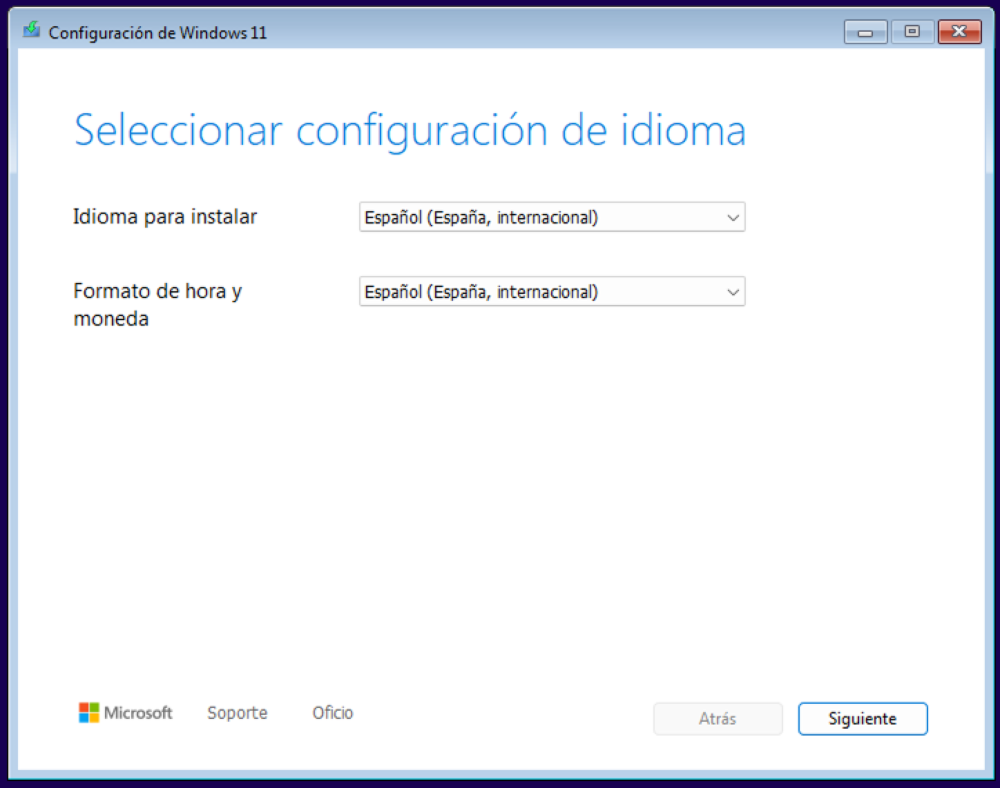

# Unidad 2 - Instalación de Windows 11

## Proceso de instalación

En este punto comenzaremos con la instalación de Windows 11 en nuestro PC o máquina virtual. Una vez cargado el medio de instalación de Windows nos aparecerá la pantalla para seleccionar el idioma de configuración y el formato de hora y moneda. Seleccionaremos *Español (España, internacional)* en ambos casos y haremos clic en el botón *Siguiente*.



A continuación, deberemos seleccionar el teclado o método de entrada. Volvemos a seleccionar *Español* y hacemos clic en el botón *Siguiente*.


 En la siguiente pantalla el asistente de instalación nos pregunta sobre si queremos instalar Windows 11 o reparar el equipo. En nuestro caso, puesto que se trata de una instalación de cero, en la que no existe contenido alguno anterior en el disco, seleccionamos *Instalar Windows 11*, y marcamos la casilla de *I agree everything will be deleted including files, apps, and settings*. Seguidamente clicamos en el botón *Siguiente*.


La siguiente ventana nos solicitará una clave de producto de Windows 11. Podemos introducirla en dicho campo y hacemos clic en el botón *Siguiente*. También podemos clicar en *No tengo clave de producto* en caso de estar instalado una versión de evaluación.


En el siguiente paso nos solicitará que seleccionemos la imagen a instalar, es decir, la versión específica de Windows 11 que deseamos instalar. Seleccionaremos *Windows 11 Pro* y haremos clic en el botón *Siguiente*.


Ahora nos presenta el Contrato de Términos de licencia y avisos aplicables, el cual deberemos aceptar haciendo clic en el botón *Aceptar* para poder continuar con la instalación.


A continuación, se muestra la herramienta de gestión de discos, que muestra todas las unidades detectadas y permite administrarlas antes de proceder con la instalación.

En esta pantalla es posible cargar controladores adicionales mediante el enlace *Load Driver*, útil en casos donde el instalador no reconoce el disco duro. Estos controladores pueden obtenerse en un CD o memoria USB proporcionada por el fabricante, o descargarse desde su página web. Esta opción suele ser necesaria especialmente en configuraciones con discos SCSI u otros controladores específicos.

Además, podemos realizar funciones avanzadas como:

- Eliminar particiones existentes.
- Formatear particiones seleccionadas.
- Extender particiones para aprovechar más espacio.
- Crear nuevas particiones en el disco.

Si se selecciona el espacio no asignado y se pulsa *Siguiente*, el instalador creará automáticamente una partición que ocupará todo ese espacio (todo el disco en nuestro caso) y comenzará la instalación de Windows 11 en ella.

Si no se desea ocupar todo el espacio no asignado del disco, se puede hacer clic en Nuevo y especificar el tamaño que se dedicará a la instalación de Windows. Aunque el asistente hable de “crear una partición”, en realidad lo que se define es cuánto espacio del disco se reserva para el sistema. Al confirmar con Aplicar, aparece un mensaje indicando que se crearán de manera automática las particiones necesarias para que Windows funcione correctamente.

En un ordenador con UEFI y esquema de particionamiento GPT, el instalador genera normalmente las siguientes particiones:

1. Partición de recuperación del sistema (500 MB): contiene herramientas de reparación, como el Entorno de Recuperación de Windows (Windows RE).
2. Partición del sistema EFI (100 MB): es la partición de arranque de los equipos con GPT. Debe estar en formato FAT32 y solo contiene archivos esenciales para iniciar el sistema.
3. Partición reservada de Microsoft (MSR, 16 MB): no tiene letra de unidad ni permite almacenar datos de usuario. Se utiliza internamente por Windows para gestionar el disco.
4. Partición principal de Windows: aquí se instala el sistema operativo. Requiere al menos 20 GB de espacio para la versión de 64 bits (16 GB en la de 32 bits) y debe estar formateada en NTFS.

Con esta estructura, el sistema queda preparado para arrancar en modo UEFI de forma segura y eficiente.


Si el PC tiene Firmware BIOS o UEFI configurado en modo de compatabilidad de BIOS (BIOS Legacy), el instalador de Windows detectará este supuesto e instalará Windows con un esquema de particinamiento MBR y dos particiones:

- Partición de sistema (100 MB): Partición de arranque.
- Partición principal de Windows: Aquí se encontrará instalado el sistema operativo.


Cómo último paso en el asistente de instalación seremos preguntados sobre proceder con la instalación o volver atrás. Hacemos clic en el botón *Instalar*.


En este punto el instalador comenzará a realizar la copia de archivos e instalación propiamente dicha. Seguiremos las indicaciones que aparecen en él y esperaremos su finalización.


Una vez completada la instalación propiamente dicha, comenzará el proceso de configuración inicial básica, que requerirá de la intervención del usuario. Comenzará preguntando acerca del país o región en donde nos encontramos. Seleccionamos *España* y hacemos clic en el botón *Sí*.


A continuación, volvemos a ser preguntados sobre la distribución de teclado que deseamos usar. Seleccionamos *Español* y clicamos en el botón *Sí*.


Llegados a este punto el asistente nos preguntará si deseamos añadir una segunda distribución de teclado. En nuestro caso, lo omitiremos haciendo clic en el botón correspondiente.


En la siguiente pantalla, el asistente comenzará a realizar varias configuraciones, como se puede observar en la siguiente imagen, que se pueden extender durante varios minutos.


El siguiente paso nos requerirá el nombre del dispositivo, el cual debe cumplir una serie de normas. Este nombre es posible cambiarlo posteriormente. En nuestro caso introducimos, por ejemplo, *VirtualBoxWin11* y hacemos clic en *Siguiente*.


En este punto, el asistente de configuración nos solicita información acerca de si el dispositivo se utilizará para uso personal, o profesional o educativo (formando parte de una organización). Seleccionamos *Configurar para uso personal* y hacemos clic en *Siguiente*.


A continuación, nos solicitará que iniciemos sesión con una cuenta de Microsoft para continuar con la configuración. Esto es un requisito en las últimas versiones de Windows 11, pero podemos hacer un *pequeño truco* para saltárnoslo y poder crear únicamente una cuenta de usuario local. 


Para ello, pulsamos la combinación de teclas *Shift + F10* y se abrirá una terminal (consola de comandos). En ella introduciremos el siguiente comando y pulsamos *Enter*:

```
start ms-cxh:localonly
```


Esta acción abrirá una ventana que nos permitirá crear un nuevo usuario en local. Deberemos introducir un nombre de usuario, contraseña, y la respuesta a tres preguntas de seguridad para poder recuperar la contraseña en caso de olvido.


Rellenamos todos los campos con la información solicitada y hacemos clic en el botón *Siguiente*. De esta forma evitamos tener que usar una cuenta de Microsoft para iniciar sesión en nuestro sistema operativo.


Seguidamente, el sistema operativo continuará realizando configuración, las cuales pueden alargarse varios minutos, mostrando pantallas similares a la siguiente imagen:


A continuación, una vez finalizada la configuración automática anterior, el asistente nos realizará varias preguntas sobre la autorización de cesión de datos personales recopilados por el sistema operativo con fines de mejora de rendimiento y experiencia de usuario. Marcamos, de forma sucesiva en *No* o *Solo obligatorios*, y hacemos clic en el botón *Aceptar*.


Llegados a este punto, la configuración inicial finalizará y se nos mostrará el escritorio de nuestro sistema operativo con la sesión iniciada del usuario que hemos introducido anteriormente.


## Actualización de Windows

Una buena práctica tras la instalación del sistema operativo es la actualización de este. Para realizarla hacemos clic en el botón *Inicio* (icono de Windows), después en *Configuración*, y en el menú de la izquierda en *Windows Update*.


En este punto deberían aparecernos algunas instalaciones ya encontradas. Para instalarlas hacemos clic en el botón *Descargar e instalar todo*. Si no nos aparece ninguna actualización disponible podemos buscarlas con el botón *Buscar actualizaciones*.

El proceso de instalación suele ser lento y en bastantes ocasiones nos solicitará reiniciar el sistema para finalizar.

 

Hoy en día, Windows Update ofrece controladores de la mayoría del hardware común (tarjetas de red, sonido, gráficas básicas, periféricos…). Eso significa que un equipo recién instalado suele funcionar de forma aceptable sin necesidad de buscarlos manualmente, aunque no siempre son los más recientes ni los más completos.

## Desactivar actualizaciones automáticas

En el uso de máquinas virtuales, resulta conveniente desactivar las actualizaciones automáticas de Windows 11 porque estas consumen recursos adicionales de CPU, memoria y disco, lo que puede ralentizar el rendimiento de la máquina virtual. Además, las actualizaciones pueden modificar configuraciones o instalar cambios que afecten a la estabilidad del sistema virtualizado, dificultando la práctica y el aprendizaje en un entorno controlado.

Para desactivar las actualizaciones automáticas en Windows 11 podemos hacer lo siguiente:

1. Pulsa Win + R, escribe services.msc y presiona Enter.
2. Busca Windows Update en la lista.
3. Haz doble clic → en Tipo de inicio, selecciona Deshabilitado.
4. Pulsa Detener y luego Aplicar.

{width=500}

 


## Creación de una carpeta compartida entre el anfitrión y el huésped

Cuando trabajamos con máquinas virtuales, a menudo necesitamos intercambiar archivos entre el sistema host (el ordenador físico) y el sistema guest (la máquina virtual). Aunque es posible hacerlo mediante memorias USB o enviando archivos por la red, estas opciones son menos prácticas y más lentas.

Las carpetas compartidas de VirtualBox ofrecen una solución más sencilla y eficiente: permiten que una carpeta del host sea accesible directamente desde el guest, como si formara parte de sus propias unidades de almacenamiento. De esta forma, se pueden transferir documentos, programas o configuraciones sin necesidad de recurrir a dispositivos externos ni configuraciones de red complejas.

En resumen, las carpetas compartidas facilitan el trabajo en entornos virtualizados porque agilizan el flujo de archivos, ahorran tiempo y mejoran la integración entre el host y la máquina virtual.

Lo primero que deberemos realizar es crear la carpeta compartida en nuestro host (máquina real), por ejemplo, en el escritorio.

 

A continuación, nos dirigimos a VirtualBox, seleccionamos la máquina virtual huésped donde queremos compartir los archivos y entramos en **Configuración -> Carpetas compartidas**.

 

Hacemos clic en el botón **+** (Agregar nueva carpeta compartida) e incluimos:

- **Ruta de la carpeta**: introducimos la ruta de la carpeta que creamos en el host.
- **Nombre de la carpeta**: nombre identificativo.
- Marcamos las casillas de:
    - Automontar.

Guardamos los cambios.

 

 

Desde este momento, al iniciar nuestro sistema huésped tendremos la carpeta compartida funcionando. Para acceder a ella desde nuestra máquina virtual, debemos ir a *Este Equipo*, y podremos verla en *Ubicaciones de red*.


## Acceder a un dispositivo de almacenamiento externo USB desde la máquina virtual en VirtualBox

Si conectamos un *pendrive* u otro dispositivo de almacenamiento externo a nuestra máquina real (host) a través de un puerto USB, este no *se verá* desde la máquina huésped. Para poder acceder desde esta última deberemos realizar los siguientes pasos.

Comenzaremos descargando e instalando el [Oracle VirtualBox Extension Pack](https://download.virtualbox.org/virtualbox/7.2.2/Oracle_VirtualBox_Extension_Pack-7.2.2.vbox-extpack). Si hacemos doble clic en el archivo descargado seremos preguntados acerca de instalar este paquete de instalación. Pulsamos en el botón *Instalar*. Aceptamos las condiciones y esperamos que finalice.

A continuación, con la máquina virtual apagada, nos dirigimos a la configuración de la misma, desde **Configuración -> Puertos USB**. Marcamos la opción de Controlador USB 3.0 (xHCI) (si no lo estaba anteriormente).


Seguidamente, hacemos clic en el icono de **+ (Agregar nuevo filtro USB)**, seleccionamos el dispositivo de la lista (por nombre y fabricante) y este se añadirá como filtro para que el anfitrión lo pueda capturar.


Iniciamos la máquina virtual, insertamos el pendrive en la máquina host (si lo habíamos retirado) y en la barra superior de VirtualBox nos dirigimos a **Dispositivos -> USB -> [Nombre del pendrive]**. En este punto, lo seleccionamos si no aparece seleccionado.


En nuestra máquina virtual nos dirigimos al explorador de archivos, accedemos a *Este Equipo* y podremos ver como el dispositivo de almacenamiento USB está disponible para acceder a él como una unidad extraíble normal.


