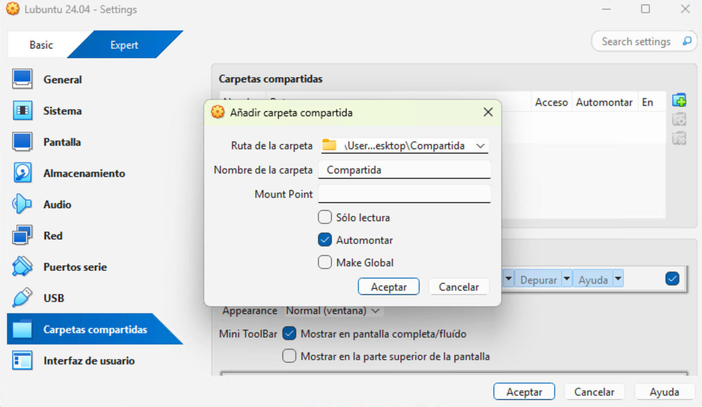
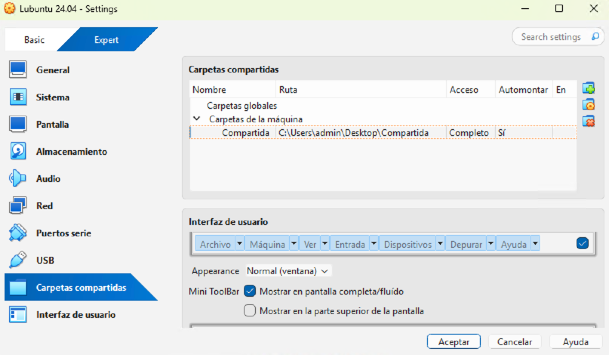
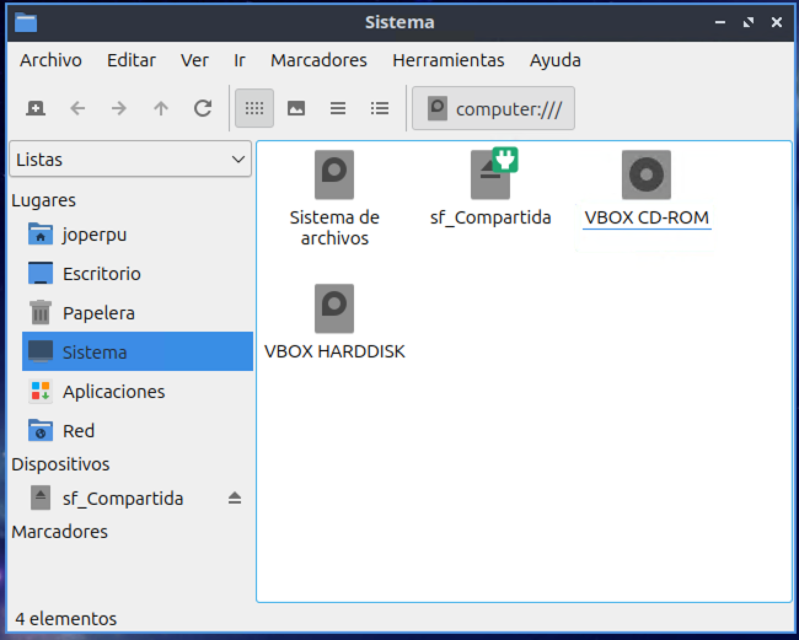
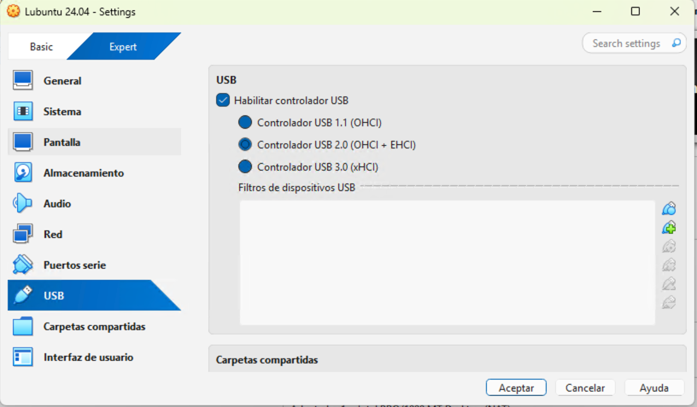
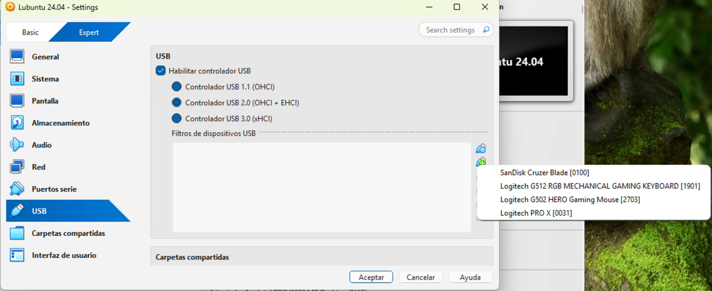
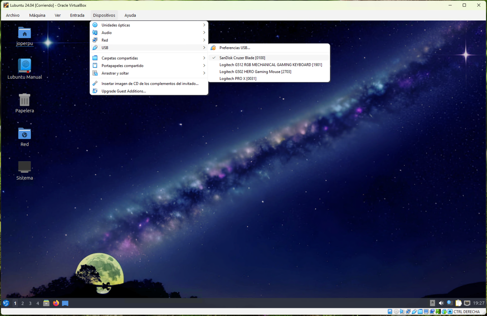

# Unidad 2 - Instalación de GNU/Linux

## GNU/Linux

GNU/Linux es el resultado de la combinación del núcleo Linux, creado por Linus Torvalds, y el proyecto GNU, impulsado por la Free Software Foundation. De su unión surgió un sistema operativo completo acompañado de numerosas aplicaciones de usuario, caracterizado por ser de libre distribución y altamente versátil.

### Introducción al software libre

El software libre otorga a los usuarios la libertad de usar, copiar, estudiar, modificar y redistribuir el programa. Según la Free Software Foundation, se considera libre si cumple con las siguientes cuatro libertades:

- Libertad 0: ejecutar el programa para cualquier propósito.
- Libertad 1: estudiar cómo funciona y adaptarlo a las propias necesidades (requiere acceso al código fuente).
- Libertad 2: redistribuir copias y compartirlas con otros.
- Libertad 3: mejorar el programa y poner esas mejoras a disposición de la comunidad.

Es importante señalar que software libre no es sinónimo de software gratuito. Puede existir software libre de pago, siempre que respete estas libertades. Del mismo modo, un software gratuito puede no ser libre si no cumple los principios anteriores.

Ventajas del software libre:

- Económico: permite a particulares y pequeñas empresas reducir costes al evitar grandes inversiones en licencias.
- Libertad de uso y redistribución: puede instalarse y compartirse sin restricciones de licencias por equipo.
- Independencia tecnológica: el acceso al código fuente facilita la creación de nuevos desarrollos sin partir de cero.
- Fomenta la competencia en servicios: el negocio se centra en la asistencia y el soporte, no en la venta de licencias.
- Soporte a largo plazo: a diferencia de ciertos modelos propietarios, muchas comunidades de software libre mantienen versiones estables durante años.
- Formatos estándar: prioriza la interoperabilidad y evita los problemas de los formatos cerrados.
- Mayor seguridad: al ser público el código, posibles vulnerabilidades pueden detectarse y resolverse con rapidez.
- Corrección ágil de errores: la comunidad suele publicar parches más rápido que en software propietario.
- Gestión sencilla de programas: la mayoría de distribuciones cuentan con gestores de paquetes que permiten instalar aplicaciones de forma centralizada y segura.
- Expansión constante: su uso está ampliamente consolidado en servidores, supercomputadoras y empresas de primer nivel como Google, IBM, HP o incluso Microsoft en parte de su infraestructura.

GNU/Linux es, hoy en día, una alternativa sólida y madura, utilizada tanto en entornos profesionales como personales, y con un futuro de crecimiento asegurado.

#### Evolución histórica del software libre

En las décadas de 1960 y 1970, el software no se concebía como un producto independiente, sino como un complemento que acompañaba a los grandes ordenadores (mainframes) de la época. En aquel contexto, era habitual que los programadores compartieran libremente su trabajo dentro de comunidades de usuarios como DECUS, lo que fomentaba la colaboración y el intercambio de conocimientos.

A finales de los años setenta, las empresas empezaron a imponer restricciones mediante licencias, limitando la posibilidad de modificar y redistribuir el software. Ya en los años ochenta, los nuevos ordenadores comenzaron a incluir sistemas operativos privativos que obligaban a aceptar condiciones restrictivas. Así, si un programador detectaba un error en un programa, debía comunicarlo al fabricante en lugar de corregirlo por sí mismo, incluso si tenía la capacidad técnica para hacerlo.

Un ejemplo clave lo vivió Richard M. Stallman en su trabajo con una impresora de red que sufría atascos frecuentes sin enviar avisos a los usuarios. Stallman intentó mejorar el controlador para solucionar el problema, pero la empresa propietaria le negó el acceso al código fuente. Ante esta situación, Stallman decidió impulsar una alternativa: en 1984 inició el proyecto GNU y, un año después, fundó la Free Software Foundation (FSF). Con ello introdujo la definición formal de software libre y el concepto de copyleft, destinado a garantizar la libertad de uso, estudio y distribución, y a evitar la apropiación privativa del software.

#### Código abierto

El término software libre a menudo genera confusión porque en inglés se denominó inicialmente Free Software, y la palabra free puede interpretarse tanto como “libre” como “gratuito”. Para evitar malentendidos, a finales de los noventa comenzó a popularizarse el concepto de código abierto (Open Source).

El código abierto mantiene las mismas libertades fundamentales que el software libre: los usuarios pueden leer, modificar y redistribuir el código fuente. Este modelo promueve una evolución rápida del software, pues la comunidad detecta y corrige errores de manera ágil, adapta los programas a diferentes necesidades y contribuye de forma colaborativa a crear soluciones de mayor calidad que las obtenidas bajo modelos privativos.

#### El proyecto GNU y el origen de GNU/Linux

UNIX fue un sistema operativo propietario muy popular gracias a su arquitectura robusta y estable. El proyecto GNU, iniciado por Richard Stallman, se diseñó para ser totalmente compatible con UNIX, lo que significaba que podía construirse a partir de pequeñas piezas de software que podían reutilizarse, adaptarse o reescribirse.

Para garantizar que GNU se mantuviera libre y accesible para todos, se creó la Licencia General Pública de GNU (GPL), basada en el principio de copyleft. Este modelo aseguraba que cualquier usuario pudiera ejecutar, copiar, modificar y distribuir el software, evitando restricciones derivadas del copyright tradicional.

En 1985, Stallman fundó la Free Software Foundation (FSF) con el fin de dar soporte legal, logístico y financiero al proyecto GNU. Aunque la FSF contrató programadores, gran parte del desarrollo continuó en manos de colaboradores voluntarios. A medida que el proyecto crecía, también se sumaron empresas interesadas en apoyar o comercializar productos basados en GNU.

Hacia 1990, GNU ya contaba con compiladores, bibliotecas y utilidades básicas, pero carecía de un núcleo. En 1991, Linus Torvalds desarrolló el núcleo Linux y lo liberó bajo licencia GPL, lo que atrajo rápidamente a una comunidad de desarrolladores que colaboraron a través de Internet. En 1992, al combinar GNU con Linux, nació un sistema operativo libre y plenamente funcional conocido como GNU/Linux.

#### Distribuciones Linux

Una distribución Linux (o distro) es una versión del sistema operativo que incluye el núcleo Linux junto con diferentes conjuntos de software y herramientas adaptados a distintos perfiles de usuarios. Generalmente, incorporan las utilidades del proyecto GNU, bibliotecas, el sistema de ventanas X y un entorno de escritorio como GNOME o KDE.

Las distribuciones pueden orientarse a diferentes ámbitos: uso doméstico, educativo, empresarial o servidores. Aunque la mayoría se compone principalmente de software libre, algunas incluyen controladores o aplicaciones privativas para mejorar la compatibilidad.

Entre las distribuciones más reconocidas se encuentran:

- Linux Mint
- Ubuntu
- Fedora
- Debian
- openSUSE
- Arch Linux
- PCLinuxOS
- CentOS
- Mageia
- Slackware
- FreeBSD (aunque no está basada en Linux, suele mencionarse como alternativa en el ecosistema de software libre).

Cada distribución responde a diferentes necesidades, pero todas comparten la filosofía de libertad, flexibilidad y comunidad que caracteriza al software libre.

### Ubuntu

Ubuntu es una de las distribuciones de Linux más populares y está basada en Debian. Su objetivo principal es ofrecer un sistema operativo fácil de usar, accesible para el usuario promedio y con una experiencia gráfica amigable. Al igual que otras distribuciones GNU/Linux, Ubuntu está compuesto por software libre y de código abierto, lo que le ha permitido crecer con rapidez y consolidarse como la distribución más utilizada a nivel mundial.

El proyecto está patrocinado por Canonical Ltd., empresa británica fundada por el empresario sudafricano Mark Shuttleworth. Canonical no obtiene beneficios mediante la venta directa de Ubuntu, sino a través de servicios relacionados, como el soporte técnico y soluciones empresariales. Gracias a que se distribuye libre y gratuitamente, cuenta además con la colaboración activa de la comunidad de desarrolladores, que contribuye a mejorar sus componentes.

Canonical respalda oficialmente varias derivadas de Ubuntu, entre ellas:

- Kubuntu, que utiliza el entorno de escritorio KDE.
- Xubuntu, con el ligero entorno Xfce.
- Lubuntu, orientado a equipos de bajos recursos con LXQt.
- Ubuntu Server, optimizado para entornos de servidor.

Existen también variantes no oficiales como Ubuntu Studio (enfocada en la creación multimedia) o distribuciones adaptadas a necesidades específicas.

Ubuntu sigue un calendario de lanzamientos predecible: publica una nueva versión cada seis meses, con soporte oficial durante 18 meses. Además, cada dos años aparece una versión LTS (Long Term Support), con soporte extendido de 5 años tanto para escritorio como para servidor. Estas versiones LTS son las más recomendadas para entornos de producción y uso profesional.

Su nombre proviene del término sudafricano Ubuntu, que significa “humanidad hacia otros”, y su eslogan original fue “Linux for human beings” (Linux para seres humanos).

En la actualidad, la última versión LTS disponible es Ubuntu 24.04 LTS (Noble Numbat), publicada en abril de 2024, que sustituye a la 22.04 LTS.

### Lubuntu

Llegamos a este punto vamos a proceder a la instalación de un sistema operativo GNU/Linux. En nuestro caso, y debido a las limitaciones de rendimiento que en ocasiones podemos encontrar con las máquinas virtuales, vamos a trabajar con Lubuntu. 

Lubuntu es una distribución ligera del sistema operativo GNU/Linux, basada en Ubuntu, que utiliza el entorno de escritorio LXQt (anteriormente LXDE) como interfaz gráfica.

Su principal característica es que está diseñada para ser rápida, sencilla y consumir pocos recursos, por lo que resulta ideal para ordenadores con hardware limitado o más antiguos.

Algunas claves de Lubuntu:

- Está basada en Ubuntu, por lo que utiliza los mismos repositorios y hereda su estabilidad y facilidad de uso.
- Usa LXQt, un entorno de escritorio minimalista, eficiente y con un aspecto moderno pero ligero.
- Requiere menos memoria RAM y CPU que otras versiones de Ubuntu (como Ubuntu con GNOME o Kubuntu con KDE).
- Es compatible con la mayoría del software de Ubuntu y se actualiza en paralelo con sus versiones oficiales.
- Es una buena opción tanto para equipos antiguos como para usuarios que buscan un sistema rápido y sencillo sin sobrecargar su máquina.

### Instalación de Lubuntu

En este punto vamos a comenzar la instalación de Lubuntu 24.04 en nuestro PC o máquina virtual. Podemos descargar la ISO necesaria desde el [siguiente enlace](https://cdimage.ubuntu.com/lubuntu/releases/noble/release/lubuntu-24.04.3-desktop-amd64.iso). Una vez cargado el medio de instalación nos aparecerá el menú de Grub, donde deberemos seleccionar la opción *Try or install Lubuntu* y pulsar *Enter*.


El instalador comenzará a cargar archivos y deberemos ver una pantalla similar a la siguiente:


A continuación, somos preguntados sobre el idioma de la instalación, donde seleccionaremos *Español de España*, y si queremos probar o instalar Lubuntu. Como muchos sistemas operativos basados en Linux, Lubuntu permite probar su sistema operativo sin necesidad de instalarlo en nuestro PC. Esta opción es útil en algunos casos, como para recuperar un sistema operativo dañado, realizar diagnóstico de hardware o probar una distribución del propio sistema operativo. En nuestro caso haremos clic en el botón *Install Lubuntu*.


Seguidamente se nos mostrará el asistente de instalación, cuya primera configuración será seleccionar el idioma con el que deseamos usar el sistema operativo. Seleccionamos *Español de España* y hacemos clic en el botón *Siguiente*.


En este punto debemos introducir la región y el uso horario, para lo cual seleccionaremos *Europe* y *Madrid*, respectivamente. A continuación, hacemos clic en *Siguiente*.


El siguiente paso nos pedirá seleccionar la distribución de teclado. Seleccionamos *Spanish* y *Predeterminado* y hacemos clic en el botón *Siguiente*.


La siguiente ventana del asistente nos solicitará diversa información acerca de la instalación. En primer lugar deberemos seleccionar *Normal installation* como modo de instalación. Marcaremos la casilla *Download and install updates following installation*, para descargar las actualizaciones disponibles para el sistema operativo. Finalmente, hacemos clic en el botón *Siguiente*.


A continuación, deberemos seleccionar las particiones en las que creamos el disco de nuestra instalación. En nuestro caso, seleccionamos todo el disco disponible marcado la opción *Borrar el disco*, *Swap en archivo* y *ext4*. Hacemos clic en *Siguiente*.


Seguidamente, debemos introducir el nombre, nombre de usuario, contraseña y nombre para el equipo. Introducimos todos estos datos y hacemos clic en *Siguiente*.


En este punto se nos mostrará un resumen de todas las opciones que hemos marcado en el asistente de instalación. Si estamos de acuerdo hacemos clic en *Instalar*. Volveremos a ser preguntados para confirmar nuestra decisión. Hacemos clic en *Instalar ahora*.


El instalador comenzará a crear particiones, copiar archivos y demás operaciones necesarias.


Finalizada la instalación, el asistente nos informará de ello. Marcamos la opción *Reiniciar ahora* y hacemos clic en el botón *Hecho*. A continuación, el sistema operativo nos pedirá que extraigamos el medio de instalación. Pulsamos *Enter* para ello.


Iniciamos el sistema operativo y lo primero que nos solicitará será la contraseña del usuario que creamos en la instalación. Accedemos con nuestras credenciales.


Llegados a este punto, e igual que hicimos con la instalación de Windows 11, procederemos a actualizar para instalar los posibles paquetes obsoletos de nuestra instalación. Para ello abrimos una terminal y ejecutamos los siguientes comandos:

```
sudo apt update
```

```
sudo apt upgrade
```


## Creación de una carpeta compartida entre el anfitrión y el huésped

Cuando trabajamos con máquinas virtuales, a menudo necesitamos intercambiar archivos entre el sistema host (el ordenador físico) y el sistema guest (la máquina virtual). Aunque es posible hacerlo mediante memorias USB o enviando archivos por la red, estas opciones son menos prácticas y más lentas.

Las carpetas compartidas de VirtualBox ofrecen una solución más sencilla y eficiente: permiten que una carpeta del host sea accesible directamente desde el guest, como si formara parte de sus propias unidades de almacenamiento. De esta forma, se pueden transferir documentos, programas o configuraciones sin necesidad de recurrir a dispositivos externos ni configuraciones de red complejas.

En resumen, las carpetas compartidas facilitan el trabajo en entornos virtualizados porque agilizan el flujo de archivos, ahorran tiempo y mejoran la integración entre el host y la máquina virtual.

!!! info
    Para que esta guía funcione es necesario tener previamente instalados los VirtualBox Guest Additions.

Lo primero que deberemos realizar es crear la carpeta compartida en nuestro host (máquina real), por ejemplo, en el escritorio.

A continuación, nos dirigimos a VirtualBox, seleccionamos la máquina virtual huésped donde queremos compartir los archivos y entramos en **Configuración -> Carpetas compartidas**.


Hacemos clic en el botón **+** (Agregar nueva carpeta compartida) e incluimos:

- **Ruta de la carpeta**: introducimos la ruta de la carpeta que creamos en el host.
- **Nombre de la carpeta**: nombre identificativo.
- Marcamos las casillas de:
    - Automontar.

Guardamos los cambios.





Desde este momento, al iniciar nuestro sistema huésped tendremos la carpeta compartida funcionando. Esta debería encontrarse en `/media/sf_Compartida`, donde Compartida es el nombre que le hemos puesto a la carpeta. También podemos encontrarla en *Sistema*.

En caso de no tener los permisos necesarios, podemos añadir nuestro usuario al grupo `vboxsf`:

```
sudo usermod -aG vboxsf $USER
```



## Acceder a un dispositivo de almacenamiento externo USB desde la máquina virtual en VirtualBox

Si conectamos un *pendrive* u otro dispositivo de almacenamiento externo a nuestra máquina real (host) a través de un puerto USB, este no *se verá* desde la máquina huésped. Para poder acceder desde esta última deberemos realizar los siguientes pasos.

Comenzaremos descargando e instalando el [Oracle VirtualBox Extension Pack](https://download.virtualbox.org/virtualbox/7.2.2/Oracle_VirtualBox_Extension_Pack-7.2.2.vbox-extpack). Si hacemos doble clic en el archivo descargado seremos preguntados acerca de instalar este paquete de instalación. Pulsamos en el botón *Instalar*. Aceptamos las condiciones y esperamos que finalice.

A continuación, con la máquina virtual apagada, nos dirigimos a la configuración de la misma, desde **Configuración -> Puertos USB**. Marcamos la opción de Controlador USB 3.0 (xHCI) (si no lo estaba anteriormente).



Seguidamente, hacemos clic en el icono de **+ (Agregar nuevo filtro USB)**, seleccionamos el dispositivo de la lista (por nombre y fabricante) y este se añadirá como filtro para que el anfitrión lo pueda capturar.




Iniciamos la máquina virtual, insertamos el pendrive en la máquina host (si lo habíamos retirado) y en la barra superior de VirtualBox nos dirigimos a **Dispositivos -> USB -> [Nombre del pendrive]**. En este punto, lo seleccionamos si no aparece seleccionado.



En nuestra máquina virtual Lubuntu nos dirigimos al explorador de archivos, donde debería aparecer como unidad extraíble. Si no aparece automáticamente, abrimos una terminal y escribimos:

```
lsblk
```

Ahí deberíamos ver el dispositivo (ej. /dev/sdb1). Podemos montarlo manualmente:

```
sudo mount /dev/sdb1 /mnt
```

