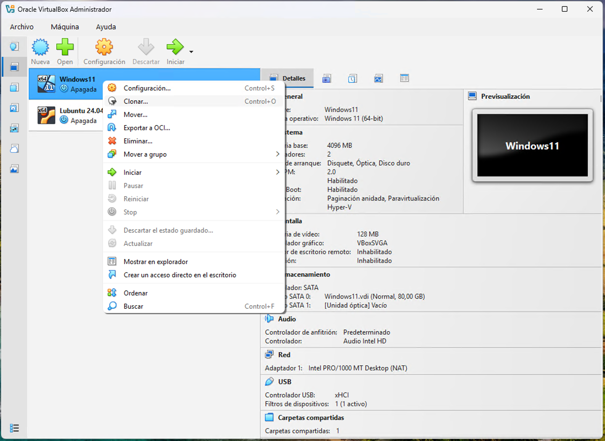

# Unidad 2 - Instalación de una máquina virtual dual

Al trabajar con máquinas virtuales, es posible instalar más de un sistema operativo en un mismo entorno, creando lo que se conoce como un sistema dual. Una de las combinaciones más habituales es contar con Windows y Linux en la misma máquina, lo que permite aprovechar las ventajas de ambos sistemas según las necesidades del usuario.

Para evitar problemas con el arranque y la gestión del gestor de inicio, es recomendable instalar primero Windows y posteriormente Linux. Esto se debe a que el instalador de Windows sobrescribe el gestor de arranque existente, mientras que las distribuciones Linux, mediante GRUB, detectan automáticamente otros sistemas instalados y permiten seleccionarlos en el inicio.

En los siguientes apartados veremos, paso a paso, cómo crear una máquina virtual con un entorno dual Windows/Linux de forma sencilla y segura.

## Proceso de instalación

El primer paso será crear una máquina virtual con Windows 11 ya creada, o clonar una ya existente. Si deseamos clonarla lo podemos hacer desde el propio VirtualBox. Para ello, seleccionamos la máquina virtual de Windows 11, hacemos clic derecho en ella -> *Clonar*.



Introducimos el nombre de la nueva máquina, dejamos el resto de parámetros tal y como se nos muestran y hacemos clic en *Terminar*. De esta forma comenzará el proceso de clonación de la máquina, el cual puede durar varios minutos.


Una vez clonada debemos eliminar el cifrado del disco que por defecto crea Windows 11. Para ello iniciamos la máquina virtual que acabamos de clonar y abrimos la terminal *Powershell* como administrador.


Procedemos ahora a descifrar el disco para lo que ejecutamos el siguiente comando:

```
Disable-BitLocker -MountPoint "C:"
```


Este proceso tardará unos minutos. Podemos comprobar el estado ejecutando el comando:

```
manage-bde -status
```


Una vez finalizado este proceso procedemos a apagar la máquina virtual y accedemos a la configuración de esta. Nos dirigimos a *Almacenamiento*, seleccionamos la unidad óptica y hacemos clic en el disco azul para seleccionar la imagen de Ubuntu. Si no la tenemos descargada previamente lo podemos hacer desde su [página oficial de descargas](https://ubuntu.com/download/desktop).


Hacemos clic en *Aceptar* y arrancamos nuestra máquina. 


Ahora debemos entrar en el Boot Manager de la máquina virtual, para ello, debemos pulsar *Escape* varias veces justo en el momento en el que se inicie esta. En este punto seleccionamos la opción *Boot Maintenance Manager* y pulsamos aceptar.


En el menú que se nos muestra deberemos seleccionar la opción de *UEFI VBOX CD* y pulsar *Enter*.


A continuación, pulsamos *Escape* para salir de esta configuración, y seguidamente pulsamos *Y*, para confirmar los cambios.


Finalmente, nos desplazamos hasta la opción *Reset* y pulsamos *Enter*.


En este punto, la máquina se quedará en negro. Hacemos clic en cerrar la ventana y apagamos la máquina virtual.


Volvemos a iniciar la máquina virtual y esta arrancará desde la ISO de Ubuntu. Seleccionamos la opción de *Try or Install Ubuntu* y pulsamos *Enter*.


Seguidamente se mostrará el asistente de instalación de Ubuntu. Seguimos los pasos tal y como se indica en las siguientes imágenes:


En el siguiente paso del asistente seremos preguntados sobre  cómo queremos instalar Ubuntu. Seleccionamos la opción de *Instalar Ubuntu junto a Windows Boot Manager* y hacemos clic en siguiente.


Seleccionamos el tamaño que queremos en nuestra instalación de Ubuntu y hacemos clic en *Siguiente*. Es importante señalar en este punto que todo aquel tamaño que asignemos será recortado de la instalación de Windows, ya que están usando el mismo "disco duro".


Continuamos con el resto de pasos del asistente de instalación.


Una vez finalice la instalación, reiniciamos y arrancará la máquina mostrando el menú de Grub, el gestor de arranque más utilizado en sistemas GNU/Linux, el cual nos dejará seleccionar entre iniciar Ubuntu o Windows (entre otras opciones).

<!-- Falta imagen -->