# Unidad 2 - Creación de un pendrive booteable

Un pendrive booteable es un USB preparado para que el firmware del equipo (UEFI o BIOS) pueda arrancar desde él y cargar un gestor de arranque que, a su vez, inicia un instalador o un sistema “Live” (arranca sin instalar, típico en GNU/Linux).

¿Qué ocurre al pulsar el botón de encendido?

1. Firmware (UEFI/BIOS) busca el primer dispositivo arrancable según el orden de arranque (Boot Order).
2. Si es UEFI:
    - Lee la Partición del Sistema EFI (ESP) del USB (normalmente FAT32) y ejecuta un fichero .efi (p. ej., \EFI\BOOT\BOOTX64.EFI).
3. Si es BIOS/Legacy:
    - Carga el MBR del dispositivo (sector 0) y salta al código del cargador allí contenido.
4. El gestor de arranque (GRUB, Windows Boot Manager, Syslinux, Ventoy…) muestra un menú o lanza directamente el instalador/Live.

ISO, “Live” e instalador:

- Una ISO es una imagen del medio de instalación (antes CD/DVD). Muchas ISOs modernas son híbridas (arrancan tanto en BIOS como en UEFI).
- Modo Live (Linux): el sistema se ejecuta desde la RAM/USB sin tocar el disco.
- Persistencia (opcional): permite guardar cambios entre reinicios (archivos, paquetes, configuración).
- Instalador: guía para particionar, copiar el sistema y configurar el arranque en el disco interno.

## Rufus

Rufus es una utilidad para formatear y crear USB de arranque (pendrives, tarjetas de memoria, etc.) de forma rápida y segura.

Cuándo usar Rufus:

- Crear medios de instalación a partir de ISOs arrancables (Windows 10/11, Ubuntu/Debian/Fedora, utilidades UEFI, etc.).
- Soporta UEFI y BIOS/Legacy, GPT/MBR y maneja ISOs “grandes”: si algún archivo supera 4 GB, puede usar UEFI:NTFS para arrancar en UEFI aunque el USB esté en NTFS.
- Poner en marcha equipos sin sistema operativo, iniciando directamente un instalador o un sistema Live de Linux.
- Ejecutar utilidades de bajo nivel (diagnóstico, clonado, antivirus offline, gestores de particiones, MemTest, etc.).
- Actualizar firmware/BIOS desde DOS (FreeDOS) cuando el fabricante lo exige en equipos antiguos o herramientas legadas.

#### Con Rufus

Descargamos la última versión de Rufus desde su [página web](https://rufus.ie/es/) y la ejecutamos. En la ventana del programa podemos ver multitud de opciones para crear nuestro USB booteable. Seleccionamos la ISO que deseemos, en nuestro caso la de Windows 11, y hacemos clic ene l botón *Empezar*.

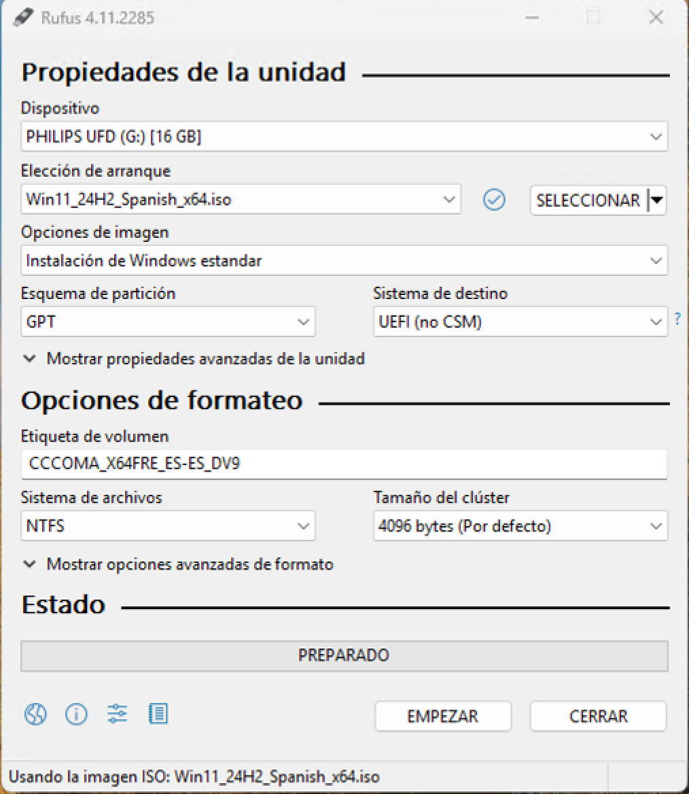

A continuación, al detectar que se trata de una instalación de Windows seremos preguntados por diversas opciones. Marcamos las mismas que se muestran en la siguiente imagen y hacemos clic en el botón *Ok*.

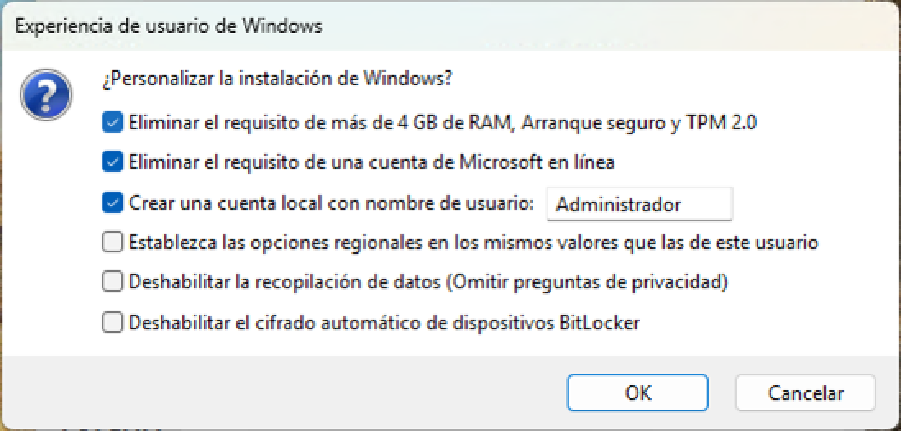

El programa comenzará a copiar archivos y nos informará cuando finalice.

##### Windows To Go

Rufus también nos permite crear un USB booteable con *Windows To Go*. Esta opción nos permite arrancar un sistema operativo Windows desde el pendrive sin necesidad de instalarlo (de la misma forma que algunas distribuciones GNU/Linux funcionan en modo *live*). Para ello, después de seleccionar la imagen de Windows 11 indicamos en el desplegable *Opciones de imagen* la opción de *Windows To Go*.

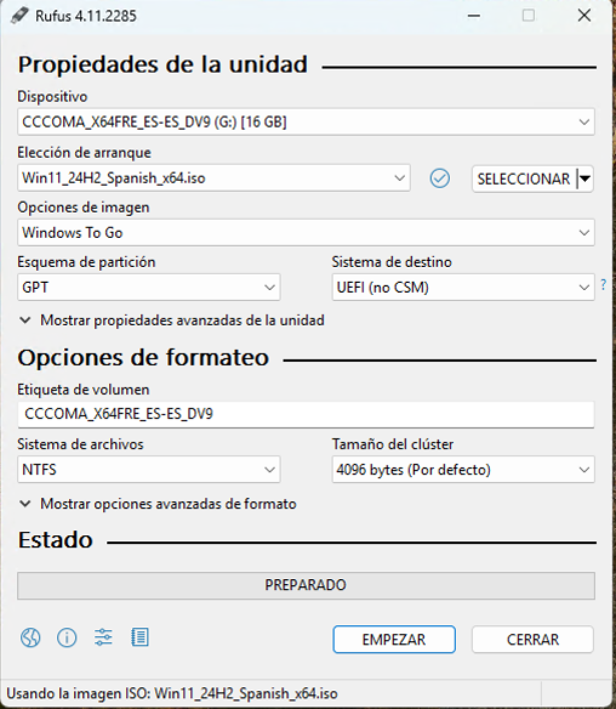

En teste punto Rufus nos preguntará sobre la versión de Windows 11 que queremos utilizar y otras preguntas acerca de la instalación del SO.

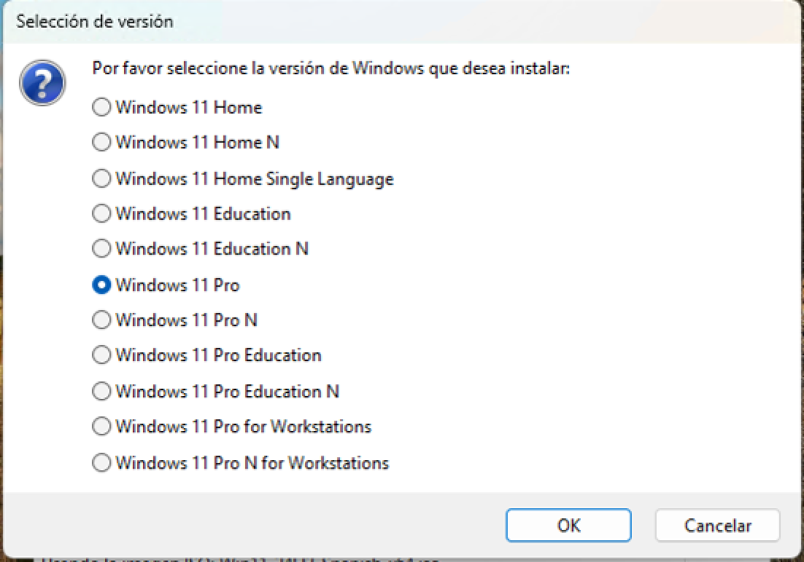
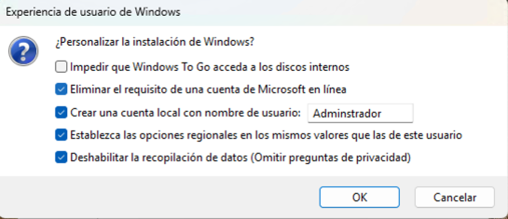

#### Con el creador de medios de Windows 11

### Creación de un USB booteable de Linux

De la misma forma que hicimos con la ISO de Windows 11 seleccionamos la de Ubuntu y hacemos clic en el botón *Empezar*. Seremos preguntados acerca del modo de imagen, para lo que seleccionamos la opción recomendada y hacemos clic en *Ok*.

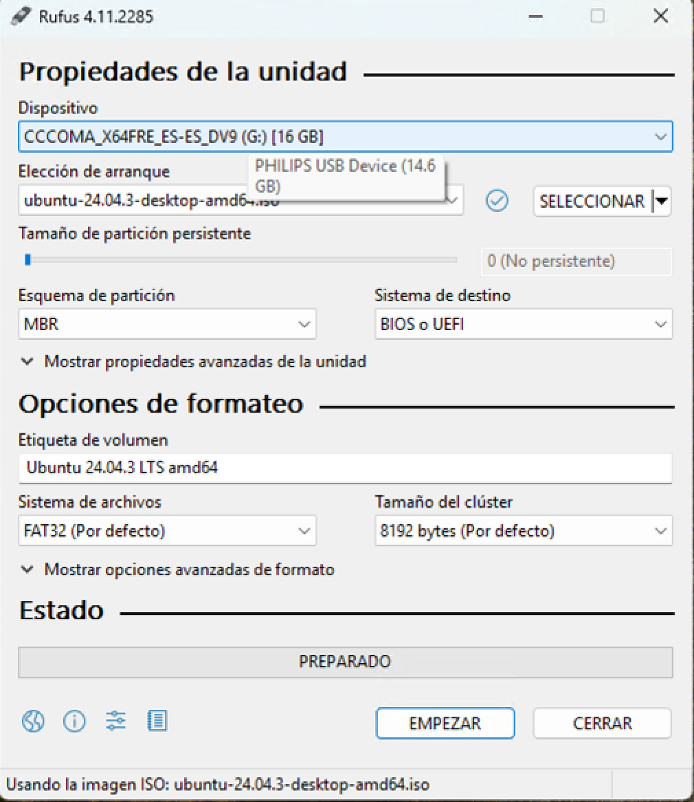
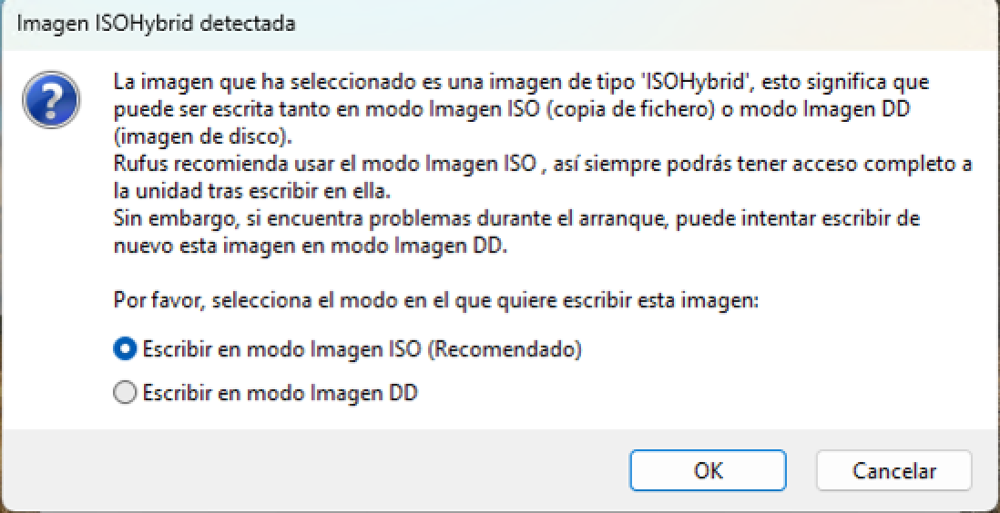

## Ventoy

Ventoy es una herramienta de código abierto que permite crear unidades USB de arranque (bootables) de manera rápida, sencilla y muy flexible. A diferencia de los métodos tradicionales, en los que es necesario formatear la memoria USB y grabar una imagen ISO cada vez que se desea cambiar de sistema operativo o herramienta, Ventoy permite copiar múltiples archivos ISO directamente al dispositivo USB y elegir cuál arrancar desde un menú interactivo al iniciar el ordenador.

Esto significa que con una sola memoria USB se pueden almacenar y utilizar varias distribuciones de Linux, instaladores de Windows, utilidades de rescate, herramientas de diagnóstico, antivirus o cualquier otro sistema arrancable. Ventoy crea un entorno de arranque compatible con BIOS y UEFI, e incluso soporta el modo Secure Boot.

Gracias a su diseño, el proceso de actualización es muy sencillo: no es necesario volver a formatear el dispositivo ni reinstalar las imágenes, ya que basta con copiar nuevas ISOs o eliminar las que ya no se necesiten. Por su versatilidad y facilidad de uso, Ventoy se ha convertido en una de las herramientas más populares entre administradores de sistemas, técnicos informáticos y usuarios avanzados que trabajan con distintos sistemas operativos o entornos de recuperación.

### Creación de un USB booteable con Ventoy

En primer lugar, nos dirigimos al apartado de descargas de su [web oficial](https://www.ventoy.net/en/download.html) y descargamos el paquete adecuado a nuestro sistema operativo.

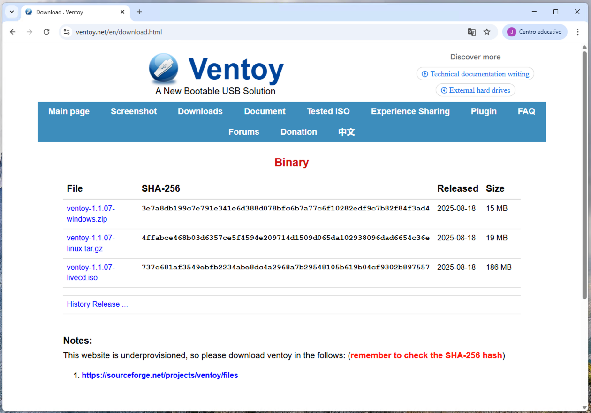

Descomprimimos el archivo ZIP y accedemos a los archivos que contiene. Hacemos clic derecho en el archivo *Ventoy2Disk.exe* y lo ejecutamos como administrador.

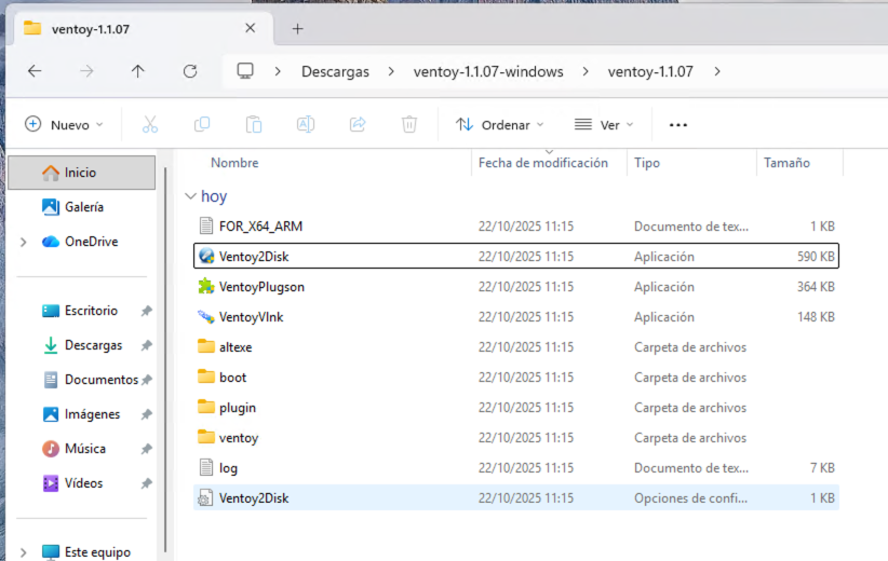

Una vez abierta la aplicación, seleccionamos nuestra unidad de almacenamiento USB en el desplegable *Device* y hacemos clic en el botón *Install*. En ese punto seremos preguntados dos veces sobre que esta acción provocará el borrado de todos los datos que tengamos en el pendrive. Hacemos clic en *Sí* y la instalación continuará.

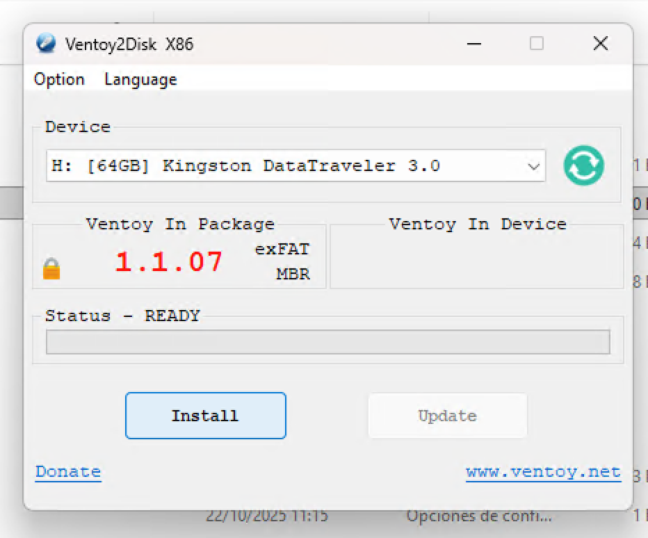
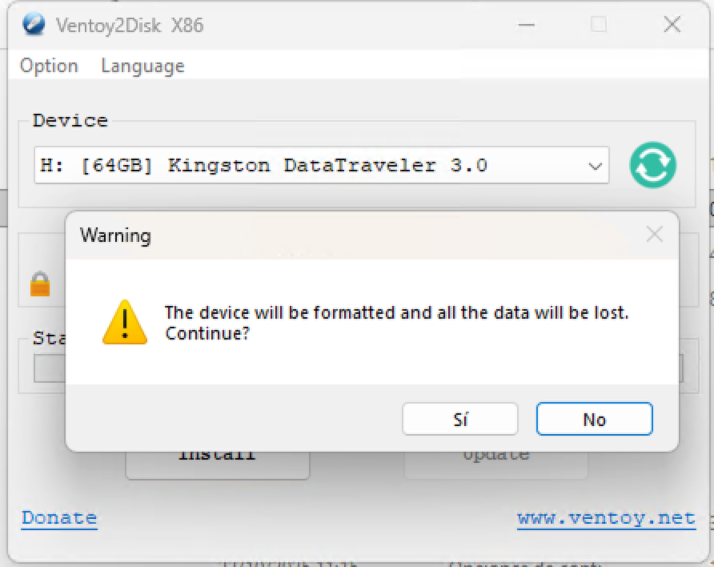

Una vez finalice nuestro pendrive tendrá como nombre Ventoy y aparentemente se encontrará vacío (aunque realmente hay una partición donde se encuentran los archivo de Ventoy).

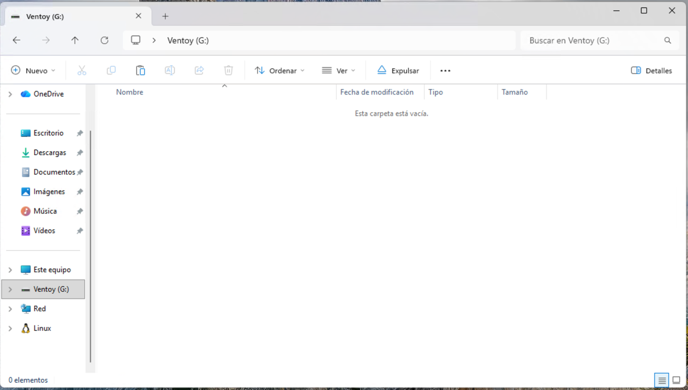

Dentro de la unidad podremos copiar tantas imágenes ISOs de sistemas operativos como queremos arrancar desde nuestro pendrive booteable.

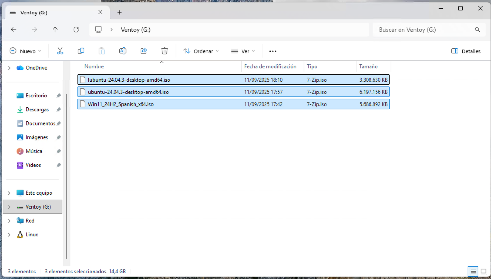