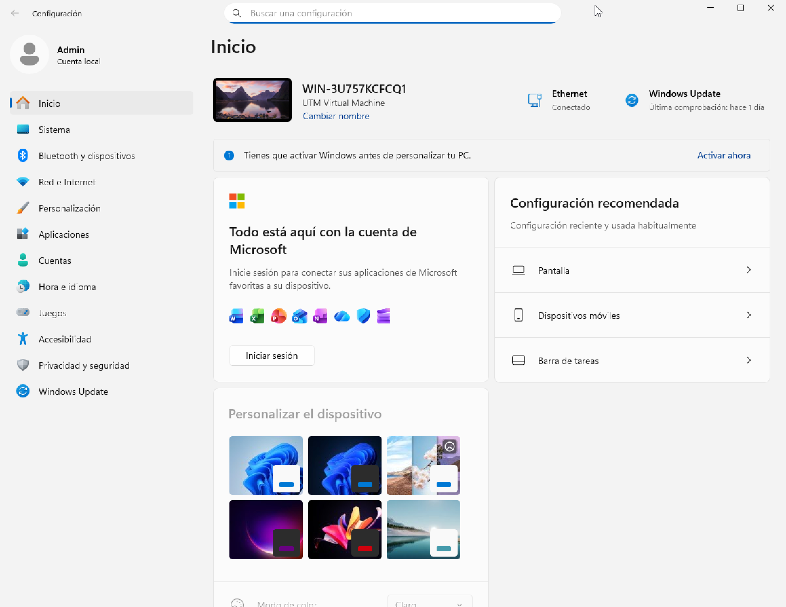
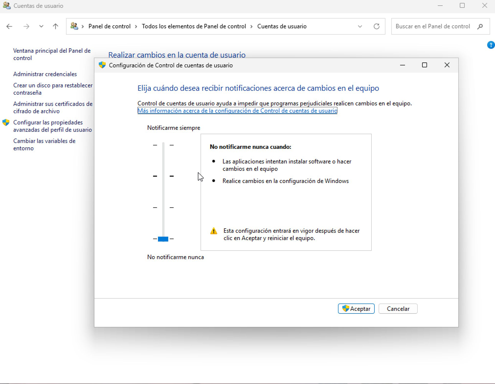
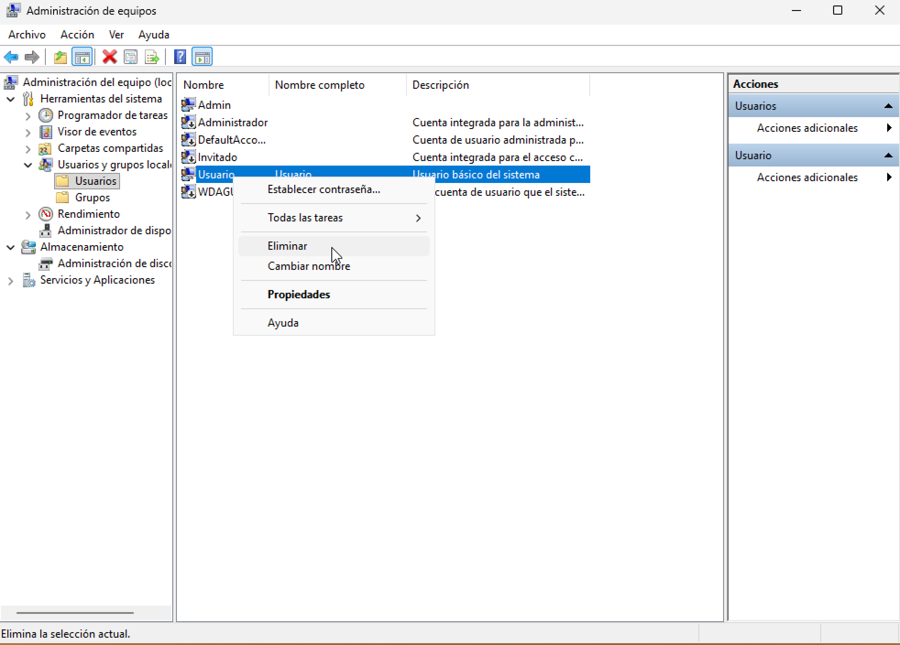
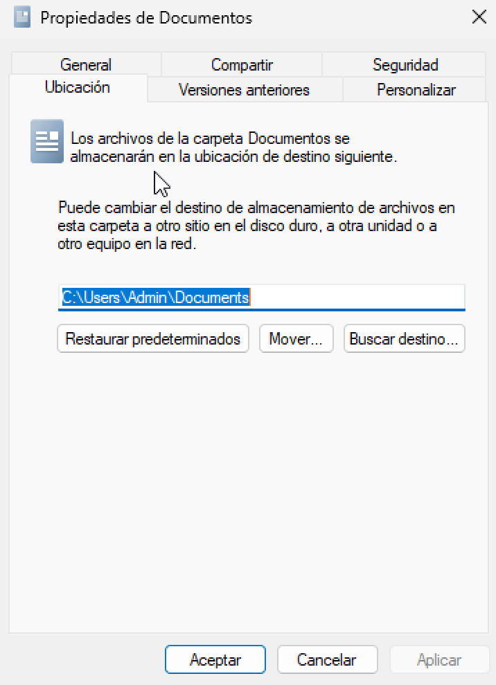
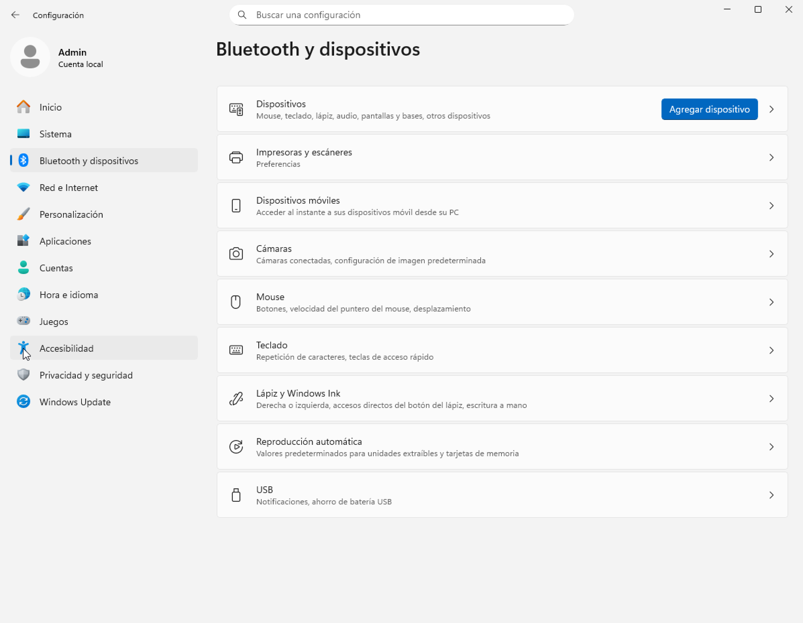

# Unidad 4 - Configuración y administración de Windows 11

## Introducción

La administración de Windows 11 abarca múltiples áreas y no se centraliza en una sola utilidad. Casi cualquier tarea administrativa puede ejecutarse desde alguno de estos lugares:

- **Configuración**: aplicación moderna (Inicio → Configuración o Win + I) donde se concentran la mayoría de ajustes del sistema. Incluye un buscador potente que localiza rápidamente páginas de configuración y utilidades del sistema (Sistema, Dispositivos Bluetooth y otros, Red e Internet, Personalización, Aplicaciones, Cuentas, Hora e idioma, Juegos, Accesibilidad, Privacidad y seguridad, Windows Update).

{ width="700" }

- **Panel de control**: sigue disponible para tareas heredadas (dispositivos, opciones de energía clásicas, algunas herramientas de red, etc.), aunque muchas opciones se han movido gradualmente a Configuración.

{ width="700" }

- **Administración de equipos (compmgmt.msc)**: consola con herramientas como Usuarios y grupos locales (no en ediciones Home), Carpetas compartidas, Administrador de dispositivos, Administración de discos, Visor de eventos, entre otras.

{ width="700" }

- **Herramientas de Windows (antes “Herramientas administrativas”)**: carpeta del menú Inicio con accesos a consolas MMC y utilidades avanzadas (Monitor de rendimiento, Directiva de seguridad local, Servicios, etc.).

{ width="700" }

### Usuarios administradores

Las tareas de administración en Windows 11 requieren pertenecer al grupo de Administradores. De forma predeterminada existen dos vías principales con este perfil:

- **Cuenta de Administrador integrada**: creada por el sistema y deshabilitada por defecto. Puede habilitarse, aunque no se recomienda su uso habitual.
- **Primera cuenta creada durante la instalación (oOOBE)**: se agrega al grupo Administradores y es la destinada al uso diario con elevación controlada.

Más adelante se verán los tipos de cuenta y su gestión; por ahora basta con recordar que únicamente las cuentas con privilegios de administrador pueden realizar operaciones administrativas.

### Control de cuentas de usuario (UAC)

UAC limita la ejecución con privilegios elevados y solicita confirmación cuando una acción requiere permisos administrativos. Su funcionamiento se basa en elevar temporalmente los privilegios solo para la tarea que lo necesita:

- Al trabajar normalmente (abrir documentos, navegar, reproducir audio), incluso con una cuenta administradora, la sesión opera con token estándar.
- Al intentar cambiar la configuración del sistema o instalar software, UAC muestra un aviso:
- Si la cuenta es administradora, se confirma con Sí para continuar.
- Si la cuenta es estándar, se solicita credencial de una cuenta administradora.
- Tras conceder permiso, la elevación se aplica solo a esa operación; después se regresa al contexto estándar. Este modelo reduce la superficie de ataque frente a malware y cambios no deseados.

Ajuste del nivel de UAC: Panel de control → Cuentas de usuario → Cambiar la configuración de Control de cuentas de usuario (deslizador de notificaciones).

{ width="700" }

### Configuración

En Windows 11, la aplicación Configuración (Inicio → Configuración o Win + I) centraliza la mayoría de tareas administrativas y ofrece un buscador que localiza páginas y utilidades del sistema. Desde aquí pueden gestionarse, entre otras, Cuentas, Red e Internet, Bluetooth y dispositivos, Aplicaciones, Privacidad y seguridad, Accesibilidad y Windows Update.

{ width="700" }

Aunque cada vez más opciones migran a Configuración, algunas funciones heredadas siguen disponibles en el Panel de control, al que se enlaza cuando es necesario.

### Panel de control

El Panel de control permanece en Windows 11 para configuraciones clásicas (algunas opciones de dispositivos, energía, determinadas herramientas de red, etc.). Puede abrirse buscándolo desde la barra de tareas. También puede mostrarse su icono en el escritorio:

1. Clic derecho en el escritorio → Personalizar.
2. Temas → Configuración de iconos de escritorio.
3. Activar Panel de control (y otros que se deseen) y Aceptar.

La vista “Ver por:” permite alternar Categoría, Iconos grandes o Iconos pequeños para mostrar todas las herramientas disponibles.

Las Herramientas de Windows (antes “Herramientas administrativas”) agrupan consolas y utilidades avanzadas (Servicios, Monitor de rendimiento, Visor de eventos, etc.). Pueden abrirse desde Inicio → Todas las aplicaciones → Herramientas de Windows y también son accesibles desde el Panel de control dentro de Sistema y seguridad.

## Administración de cuentas de usuario

Windows 11 es un sistema operativo multiusuario: varias personas pueden utilizar el equipo, localmente o por acceso remoto, manteniendo sus datos y preferencias gracias a las cuentas de usuario. Para facilitar la concesión de permisos y derechos, las cuentas pueden pertenecer a grupos de usuarios.

### Cuentas de usuario
Una cuenta de usuario es un conjunto de información que indica a Windows a qué archivos y carpetas se puede acceder, qué cambios se pueden realizar en el equipo y qué preferencias personales (fondo de escritorio, protector de pantalla, etc.) se aplican. Cada persona accede con su nombre de usuario y un método de autenticación (contraseña, PIN, Windows Hello).

En Windows 11 pueden emplearse distintos tipos de cuenta según el ámbito de uso:

- **Cuenta Microsoft (MSA)**: vinculada a los servicios en la nube de Microsoft (OneDrive, Microsoft 365, Microsoft Store, sincronización de configuración, etc.). Basta iniciar sesión en el PC para acceder a estos servicios desde cualquier dispositivo compatible.
- **Cuenta de trabajo o escuela (Microsoft Entra ID/Azure AD)**: orientada a entornos organizativos; permite directivas, acceso a recursos corporativos y administración por TI.
- **Cuenta local**: creada en el propio equipo y válida solo en él (y para acceder a recursos compartidos de red según permisos).

Además de la clase de cuenta, existen roles con distinto nivel de control sobre el sistema:

- **Cuentas estándar**: uso diario del equipo.
- **Cuentas de administrador**: control total del equipo; deben usarse solo cuando sea necesario.

#### Administrador

Una cuenta de administrador puede realizar cambios que afectan a todos los usuarios: modificar la seguridad, instalar software y hardware, acceder a todos los archivos y administrar otras cuentas. Durante la instalación o la primera configuración de Windows 11 se crea una cuenta con privilegios de administrador para configurar el equipo. Finalizada la configuración inicial, se recomienda trabajar con una cuenta estándar y elevar privilegios solo cuando sea preciso (UAC).

#### Usuario estándar

Una cuenta estándar permite usar la mayoría de las funciones del equipo, ejecutar aplicaciones instaladas y cambiar opciones que afecten únicamente al propio usuario. No puede:

- Instalar o desinstalar software y hardware.
- Eliminar archivos necesarios para el sistema.
- Cambiar configuraciones que afecten a la seguridad del equipo.

Cuando una tarea requiere privilegios elevados, Windows solicitará confirmación o credenciales de una cuenta administradora (UAC). El uso habitual de una cuenta estándar reduce el riesgo de cambios no deseados y mejora la seguridad.

#### Invitado

La cuenta integrada Invitado utilizada en versiones antiguas no está disponible para iniciar sesión en Windows 11 (permanece deshabilitada y no se recomienda su uso). Para accesos temporales se aconseja:

- Crear una cuenta local estándar sin privilegios administrativos y eliminarla cuando deje de ser necesaria, o
- Configurar Acceso asignado (kiosco) para limitar el uso a una app o conjunto de apps en escenarios públicos o de aula.

Estas alternativas ofrecen mayor control y seguridad que la antigua cuenta de invitado.

### Gestión de cuentas de usuario del equipo

Crear, modificar, eliminar o bloquear cuentas de usuario son tareas administrativas que pueden realizarse desde Configuración y, en algunos casos, desde consolas de administración. A continuación se describen los procedimientos más habituales en Windows 11.

#### Crear cuentas de usuario locales en el equipo

**Crear una cuenta desde la consola “Usuarios y grupos locales”**

Esta opción está disponible en ediciones Pro/Enterprise/Education. En Home no suele aparecer la consola “Usuarios y grupos locales”.

1.	Abrir Administración de equipos (por ejemplo, buscando Administración de equipos en el menú Inicio).
2.	Desplegar Herramientas del sistema → Usuarios y grupos locales.
3.	Hacer clic en la carpeta Usuarios.
4.	En la carpeta Usuarios, hacer clic con el botón derecho y seleccionar Usuario nuevo…
5.	Rellenar los datos del usuario.
6.	Opciones típicas:
    - El usuario debe cambiar la contraseña en el siguiente inicio de sesión: obliga al cambio en el primer acceso.
    - El usuario no puede cambiar la contraseña: impide que el usuario la cambie.
    - La contraseña nunca expira: desactiva la caducidad de contraseña para esa cuenta.
7.	Hacer clic en Crear y después en Cerrar.

{ width="700" }
{ width="700" }

Restricciones del nombre de usuario: el nombre no puede superar 20 caracteres y no debe contener caracteres no permitidos (por ejemplo: `\ / " [ ] : | < > + = ; , ? * @`).

Una vez creada la cuenta, ya puede iniciarse sesión con ella y empezar a trabajar.

####  Eliminar usuario

**Eliminar una cuenta desde el Panel de control**

1.	Abrir el Panel de control.
2.	Hacer clic en Cuentas de usuario.
3.	Hacer clic en Cuentas de usuario.
4.	Hacer clic en Administrar otra cuenta.
5.	Seleccionar la cuenta a eliminar.
6.	Hacer clic en Eliminar la cuenta.
7.	Windows preguntará si se desea conservar los archivos del usuario.
8.	Elegir Conservar archivos o Eliminar archivos, según corresponda.

{ width="700" }
{ width="700" }

**Eliminar una cuenta desde “Usuarios y grupos locales”**

1.	Abrir Administración de equipos.
2.	Herramientas del sistema → Usuarios y grupos locales → Usuarios.
3.	Seleccionar el usuario a eliminar.
4.	Botón derecho → Eliminar.
5.	Confirmar en el cuadro de diálogo.

{ width="700" }

#### Actualizar las propiedades de un usuario

En Windows 11 es posible modificar varias propiedades de una cuenta desde Configuración y desde el Panel de control. Desde Administración de equipos (Usuarios y grupos locales) también se pueden cambiar algunas opciones, aunque no todas están disponibles en todas las ediciones.

**Actualizar una cuenta desde el Panel de control**

1.	Abrir el Panel de control.
2.	Hacer clic en Cuentas de usuario.
3.	Hacer clic en Cuentas de usuario.
4.	Hacer clic en Administrar otra cuenta.
5.	Hacer clic sobre la cuenta que se va a modificar.
6.	Hacer clic en Cambiar el nombre de la cuenta para modificar el nombre mostrado.
7.	Hacer clic en Cambiar la contraseña para modificar la clave de acceso.
8.	Hacer clic en Cambiar el tipo de cuenta para pasar de cuenta estándar a administrador o viceversa.
9.	Introducir los datos necesarios en cada caso y aceptar.

**Cambiar propiedades desde “Usuarios y grupos locales” (Administración de equipos)**

1.	Abrir Administración de equipos (por ejemplo, buscándolo en el menú Inicio).
2.	Desplegar Herramientas del sistema → Usuarios y grupos locales.
3.	Hacer clic en la carpeta Usuarios para ver la lista de cuentas.
4.	Seleccionar el usuario que se quiere actualizar.
5.	Botón derecho (o Acciones adicionales) → Establecer contraseña… para asignar una nueva contraseña.
6.	Botón derecho (o Acciones adicionales) → Propiedades para editar otras opciones disponibles.
7.	Introducir los datos necesarios y hacer clic en Aceptar.

{ width="700" }
{ width="400" }

#### Deshabilitar una cuenta de usuario

Si se desea que una cuenta no pueda iniciar sesión, se puede deshabilitar. Una cuenta deshabilitada puede habilitarse más adelante. Deshabilitar una cuenta no es lo mismo que eliminarla: una cuenta eliminada no se puede restaurar.

**Deshabilitar una cuenta desde “Usuarios y grupos locales”**

1.	Abrir Administración de equipos.
2.	Desplegar Herramientas del sistema → Usuarios y grupos locales.
3.	Hacer clic en la carpeta Usuarios.
4.	Seleccionar el usuario que se quiere bloquear.
5.	Botón derecho (o Acciones adicionales) → Propiedades.
6.	Activar la casilla La cuenta está deshabilitada.
7.	Hacer clic en Aceptar.

Mientras la cuenta esté deshabilitada, el usuario no podrá iniciar sesión. Para volver a habilitarla se repiten los mismos pasos, pero desmarcando la casilla La cuenta está deshabilitada.

### Perfil de usuario

El perfil de usuario es el conjunto de información asociada a una cuenta: archivos personales (Documentos, Imágenes, Música, Vídeos, Descargas…), configuración y personalización del entorno (fondo, temas, accesibilidad, preferencias, etc.), además de otros datos como favoritos y ajustes de aplicaciones. Gracias al perfil, el usuario mantiene sus preferencias cada vez que inicia sesión.

Un perfil de usuario no es lo mismo que una cuenta de usuario:

- La cuenta sirve para iniciar sesión.
- El perfil es la información y configuración que Windows carga para ese usuario.

Cada cuenta tiene al menos un perfil asociado.

**Ubicación del perfil**

En Windows 11, los perfiles se guardan por defecto en:

- `C:\Users` (en español puede aparecer como C:\Usuarios dependiendo del sistema, pero la ruta habitual en Windows es C:\Users)

Dentro hay una carpeta por usuario (normalmente con el nombre de la cuenta), que contiene sus bibliotecas y datos de configuración.

**Cambiar la ubicación de una carpeta del perfil (Documentos, Imágenes, etc.)**

Windows permite cambiar la ubicación de carpetas concretas del perfil (por ejemplo, Documentos o Vídeos) desde sus propiedades.

1.	Abrir el Explorador de archivos.
2.	Entrar en Este equipo y localizar la carpeta (por ejemplo, Documentos, Imágenes, Vídeos…).
3.	Clic derecho sobre la carpeta → Propiedades.
4.	Abrir la pestaña Ubicación.
5.	Hacer clic en Mover… y seleccionar la nueva ruta.
6.	Hacer clic en Aceptar. Windows preguntará si se desea mover los archivos actuales a la nueva ubicación (lo habitual es Sí).

{ width="400" }
{ width="400" }

**Mover los perfiles de usuario a otra partición (precaución)**

Es posible cambiar la ubicación donde Windows crea los perfiles, pero editar el registro para mover C:\Users es una operación delicada y no es el procedimiento recomendado en equipos Windows 11 en uso normal (puede causar problemas con actualizaciones, apps y permisos). Por eso, en un entorno docente o de laboratorio suele ser mejor aplicar alternativas más seguras:

Alternativas recomendadas en Windows 11

- Mover Documentos/Imágenes/Vídeos/Descargas a D:\Usuarios\... usando la pestaña Ubicación.
- Configurar Configuración → Sistema → Almacenamiento → Configuración de almacenamiento avanzada → Dónde se guarda el contenido nuevo (para guardar documentos, música, fotos, vídeos, etc. en otra unidad).
- En entornos con dominio: Directiva de grupo para redirección de carpetas.

## Dispositivos hardware y controladores

El sistema operativo gestiona los dispositivos hardware del ordenador. Para ello mantiene un registro de cada dispositivo y asocia a cada uno un controlador o driver, que es el software que permite a Windows comunicarse con ese dispositivo.

En Windows 11 es posible gestionar parte de la configuración de los dispositivos desde Configuración, y también desde herramientas clásicas como Panel de control. Además, para una administración más completa de drivers y hardware se utiliza el Administrador de dispositivos.

### Componentes del apartado Bluetooth y dispositivos

En Windows 11, la gestión principal de hardware desde Configuración se encuentra en:

Inicio → Configuración → Bluetooth y dispositivos

{ width="700" }

Dentro de este apartado se incluyen, entre otros, los siguientes elementos:

- **Impresoras y escáneres**: muestra las impresoras conectadas al equipo y permite agregar una nueva. En muchos casos Windows detecta la impresora automáticamente, aunque algunos fabricantes proporcionan su propio instalador. Más adelante se dedica un apartado a la impresión.
- **Dispositivos**: aparece una lista con dispositivos conectados o emparejados (USB, Bluetooth, etc.). Windows normalmente los detecta al conectarlos, aunque existe opción para agregar dispositivos, especialmente en el caso de Bluetooth.
- **Mouse**: permite configurar opciones del ratón, como el botón principal (izquierdo o derecho), velocidad del puntero y el desplazamiento con la rueda.
- **Panel táctil**: permite ajustar gestos, sensibilidad y opciones para evitar movimientos accidentales mientras se escribe (según el tipo de equipo).
- **Escritura**: opciones relacionadas con la escritura, correcciones y sugerencias.
- **Reproducción automática**: permite configurar qué acción realiza el sistema al conectar dispositivos extraíbles (memorias USB, tarjetas de memoria, CDs/DVDs si existen, etc.). Si se desactiva, se evita que el contenido se abra automáticamente al conectar un medio externo, lo cual puede ayudar a reducir riesgos de ejecución automática no deseada. También se puede elegir la acción concreta para cada tipo de medio.

### Contenido de "Dispositivos e impresoras"

La ventana Dispositivos e impresoras sigue existiendo en Windows 11 dentro del Panel de control.

Ruta habitual:

- Panel de control → Hardware y sonido → Dispositivos e impresoras

{ width="700" }

En esta ventana se muestran principalmente dispositivos externos que se conectan y desconectan por USB, Bluetooth o red, además del propio equipo.

La lista de dispositivos puede incluir:

- Dispositivos portátiles que se conectan ocasionalmente, por ejemplo teléfonos móviles, cámaras digitales o reproductores portátiles.
- Dispositivos USB como discos duros externos, memorias USB, cámaras web, teclados y ratones.
- Impresoras conectadas por USB, red o de forma inalámbrica.
- Dispositivos inalámbricos, incluidos Bluetooth y receptores USB inalámbricos.
- El propio equipo.
- Dispositivos de red compatibles, por ejemplo escáneres en red, extensores multimedia o almacenamiento conectado a red (NAS).

En equipos Windows, además pueden aparecer impresoras “virtuales” instaladas por el sistema, como Microsoft Print to PDF o Microsoft XPS Document Writer (según la edición y configuración).

**Qué no suele mostrar “Dispositivos e impresoras”**

Esta ventana normalmente no muestra:

- Dispositivos internos dentro de la torre/portátil, como discos internos, tarjetas gráficas, tarjeta de sonido, memoria RAM, procesador u otros componentes internos.
- Altavoces conectados por cable analógico convencional (sí suelen aparecer si son USB o inalámbricos).
- Algunos dispositivos antiguos conectados por puertos heredados (por ejemplo PS/2), si el sistema no los expone como “dispositivos externos” en esta vista.

**Menú contextual de un dispositivo**

Si se hace clic derecho sobre un dispositivo dentro de Dispositivos e impresoras, se muestran acciones que dependen del tipo de dispositivo. Por ejemplo:

- Ver lo que se está imprimiendo (impresoras).
- Explorar archivos en una unidad externa.
- Abrir herramientas del fabricante o propiedades del dispositivo.

### Administrador de dispositivos

Para ver los dispositivos conectados al equipo que no aparecen en la ventana Dispositivos e impresoras, debe utilizarse el Administrador de dispositivos. En esta herramienta se enumera todo el hardware instalado (interno y externo) y los dispositivos conectados al sistema.

El Administrador de dispositivos está orientado a usuarios avanzados: muestra los dispositivos en forma de lista por categorías (no mediante iconos). Para realizar cambios (habilitar, deshabilitar, actualizar controladores, etc.) es necesario disponer de permisos de administrador.

Acceso al Administrador de dispositivos en Windows 11

En Windows 11 puede abrirse de varias formas:

- Clic derecho en el botón Inicio → Administrador de dispositivos.
- Buscar “Administrador de dispositivos” desde el menú Inicio.
- Panel de control → Hardware y sonido → Administrador de dispositivos.

{ width="700" }

El Administrador de dispositivos proporciona una vista del hardware instalado en el equipo. Se utiliza principalmente para instalar y actualizar controladores, modificar opciones de dispositivos y solucionar problemas.

Con el Administrador de dispositivos se puede:

- Determinar si el hardware del equipo funciona correctamente.
- Cambiar la configuración de hardware de un dispositivo.
- Identificar los controladores cargados para cada dispositivo y ver información del controlador.
- Cambiar propiedades avanzadas del dispositivo e instalar controladores actualizados.
- Habilitar, deshabilitar o desinstalar dispositivos.
- Revertir a una versión anterior del controlador.
- Ver los dispositivos por tipo, por conexión o por recursos utilizados.
- Mostrar u ocultar dispositivos ocultos (útil para diagnóstico avanzado).

Normalmente no será necesario modificar manualmente recursos (IRQ, direcciones, etc.), ya que Windows asigna estos recursos automáticamente durante la instalación del hardware.

#### Ver el estado de un dispositivo

El estado de un dispositivo indica si Windows tiene el controlador instalado y si puede comunicarse correctamente con el hardware.

Para ver el estado de un dispositivo, seguir estos pasos:

1.	Abrir el Administrador de dispositivos.
2.	Hacer doble clic en la categoría del dispositivo (por ejemplo, Adaptadores de red).
3.	Hacer clic con el botón derecho sobre el dispositivo y seleccionar Propiedades.
4.	En la pestaña General, el apartado Estado del dispositivo muestra la descripción del estado actual.

{ width="700" }

### Añadir un nuevo dispositivo

Los dispositivos que pueden añadirse a un equipo son muy variados y de distintos fabricantes. De forma general, pueden conectarse de tres maneras:

- Directamente a la placa base mediante una tarjeta de expansión.
- Externamente mediante cable USB.
- Externamente mediante una conexión inalámbrica (por ejemplo, Bluetooth o Wi-Fi).

En los dos primeros casos, normalmente se trata de dispositivos Plug and Play, que Windows detecta y configura de forma automática instalando los controladores si están disponibles. Los dispositivos inalámbricos suelen requerir un proceso de emparejamiento o adición desde el sistema.

#### Dispositivos Plug and Play

Windows admite las especificaciones Plug and Play, que permiten detectar y configurar hardware nuevo sin intervención manual. Antes de esta tecnología, el usuario debía configurar parámetros del dispositivo de forma manual antes de poder utilizarlo.

Con Plug and Play, al conectar un dispositivo, Windows intenta localizar un controlador adecuado y configurarlo automáticamente para que funcione sin interferir con el resto del hardware instalado.

Para instalar un dispositivo Plug and Play:

1.	Conectar el nuevo dispositivo al equipo (por ejemplo, por USB o instalándolo físicamente si es interno).
2.	Windows mostrará una notificación indicando que está configurando el dispositivo.
3.	Esperar a que finalice la instalación automática del controlador (si está disponible).

#### Dispositivos inalámbricos

Los dispositivos conectados por cable suelen detectarse e instalarse automáticamente. Sin embargo, para añadir un dispositivo inalámbrico (teclado, ratón, auriculares, teléfono, etc.), normalmente hay que realizar un proceso de adición, especialmente si es Bluetooth.

Para añadir un dispositivo inalámbrico en Windows 11:

1.	Abrir Configuración.
2.	Entrar en Bluetooth y dispositivos.
3.	Hacer clic en Agregar dispositivo.
4.	Seleccionar el tipo de dispositivo (por ejemplo, Bluetooth).
5.	Elegir el dispositivo de la lista y seguir las indicaciones de emparejamiento.

### Solucionar problemas relacionados con un dispositivo

Windows incluye herramientas para detectar y corregir problemas cuando un dispositivo no funciona correctamente. Si un dispositivo presenta fallos, puede mostrarse con avisos o con estado incorrecto en el sistema.

Para intentar que Windows detecte y corrija el problema:

1.	Abrir Configuración.
2.	Ir a Sistema.
3.	Entrar en Solucionar problemas.
4.	Abrir Otros solucionadores de problemas.
5.	Ejecutar el solucionador relacionado (por ejemplo, Bluetooth, Impresoras, Hardware y dispositivos, etc.).

Cuando finalice el análisis, Windows informará del problema detectado y ofrecerá aplicar una corrección automática si es posible. Si no puede solucionarlo, indicará que el usuario debe realizar la corrección manual.

#### Búsqueda del controlador de dispositivo

Si Windows informa de que un dispositivo no funciona correctamente, una causa habitual es que no tenga controlador o que el controlador sea incorrecto o esté dañado. Con Windows Update activo y conexión a Internet, Windows puede buscar controladores en línea.

Windows puede descargar dos tipos de actualizaciones relacionadas con dispositivos:

- **Controladores (drivers)**: software que permite que Windows se comunique con el hardware.
- **Información del dispositivo**: iconos, nombre del producto, fabricante, modelo y detalles adicionales para identificarlo mejor.

En Windows 11, la búsqueda de controladores se realiza principalmente desde Windows Update:

1.	Abrir Configuración.
2.	Ir a Windows Update.
3.	Entrar en Opciones avanzadas.
4.	Abrir Actualizaciones opcionales.
5.	Revisar el apartado Controladores e instalar los disponibles si corresponde.

Si Windows Update no encuentra un controlador adecuado:

- Buscarlo en el sitio web del fabricante del dispositivo (modelo exacto).
- Si el dispositivo incluye un instalador (USB/DVD o descarga), puede contener el software necesario, aunque es recomendable usar siempre la versión más reciente del fabricante.

## Gestión de discos y cuotas

La gestión de discos incluye la creación y administración de discos duros y sus particiones. Además, es posible establecer cuotas de disco para que los usuarios tengan un límite de uso de espacio.

### Administración de discos

Administración de discos es una utilidad del sistema que permite administrar discos duros y los volúmenes (particiones) que contienen. Con esta herramienta se pueden:

- Inicializar discos nuevos.
- Crear volúmenes (particiones).
- Formatear volúmenes con FAT, FAT32 o NTFS.
- Realizar la mayoría de tareas relacionadas con discos sin reiniciar el sistema, aplicándose la mayoría de cambios de forma inmediata.

En Windows 11, Administración de discos mantiene las características clásicas de versiones anteriores y permite realizar, entre otras, estas operaciones habituales:

- Crear y eliminar volúmenes (particiones).
- Formatear y asignar letra de unidad.
- Extender o reducir volúmenes desde la propia interfaz.
- Trabajar con distintos estilos de particionado según el tipo de disco.

El Administrador de discos se abre desde la consola Administración de equipos y muestra los volúmenes:

- En forma de lista en la parte superior.
- En forma gráfica en la parte inferior.

Las unidades de disco se numeran comenzando por Disco 0, Disco 1, etc. Dentro de cada disco se muestran las particiones con su tamaño y sistema de archivos.

**Inicializar un disco nuevo: MBR o GPT**

Si se añade un disco duro nuevo al equipo, Windows puede detectar que el disco no tiene tabla de particiones. En ese caso, al abrir Administración de discos aparecerá un cuadro de diálogo solicitando el estilo de partición:

- MBR (Master Boot Record)
- GPT (GUID Partition Table)

Al elegir una opción, Windows crea la tabla de particiones y el disco queda listo para crear volúmenes.

#### Crear una partición (nuevo volumen)

Si en un disco existe espacio sin asignar, se puede crear una nueva partición para disponer de más espacio de almacenamiento. Para crear una partición nueva, seguir estos pasos:

1.	Abrir Administración de discos.
2.	Hacer clic con el botón derecho sobre el espacio sin asignar y seleccionar Nuevo volumen simple….
3.	En el asistente, hacer clic en Siguiente.
4.	Indicar el tamaño de la nueva partición y hacer clic en Siguiente. Por defecto se usa todo el espacio disponible.
5.	Indicar la letra de unidad que se le asignará o la carpeta donde se montará y hacer clic en Siguiente.
6.	Escribir la etiqueta del volumen y activar la opción de formatear el volumen:
    - Se recomienda seleccionar NTFS como sistema de archivos.
    - Se recomienda activar Formato rápido para que el proceso sea más rápido. Hacer clic en Siguiente.
7.	En la pantalla de resumen, hacer clic en Finalizar.

Al terminar, se dispondrá de un nuevo volumen listo para almacenar información.

#### Formatear una partición

Formatear una partición consiste en crear un sistema de archivos. Hasta que una partición no se formatea, no puede utilizarse. Normalmente, al crear una partición el asistente ya permite formatearla, pero en algunos casos es necesario formatear de nuevo una partición (por ejemplo, en un disco, una partición existente o una memoria USB).

Formatear implica perder la información que hubiera guardada en esa partición, ya que se reemplaza el sistema de archivos anterior.

Para formatear una partición, seguir los siguientes pasos:

1.	Abrir Administración de discos.
2.	Hacer clic con el botón derecho sobre la partición a formatear y seleccionar Formatear….
3.	En el cuadro de diálogo, indicar:
    - Etiqueta: por defecto aparece la que tuviera el volumen.
    - Sistema de archivos: Windows trabaja principalmente con NTFS y FAT32.
        - En particiones de disco duro suele usarse NTFS.
        - En unidades extraíbles (por ejemplo, memorias USB) suele usarse FAT32.
    -  Tamaño de unidad de asignación: se recomienda dejar Predeterminado.
    -  Mantener activada la opción Formato rápido: el formato rápido crea la estructura del sistema de archivos sin comprobar sectores, por lo que es mucho más rápido.
4.	Para comenzar el proceso, hacer clic en Aceptar.

#### Extender una partición

Se puede aumentar el tamaño de una partición extendiéndola sobre el espacio sin asignar adyacente del mismo disco.

Para extender una partición, el volumen debe estar sin formatear o formateado en NTFS. En general, la ampliación se realiza sobre espacio contiguo. En algunos escenarios, para extender sobre espacio no contiguo, Windows puede solicitar convertir el disco en disco dinámico.

Para extender una partición, seguir los siguientes pasos:

1.	En Administración de discos, hacer clic con el botón derecho sobre el volumen que se desea extender.
2.	Seleccionar Extender volumen….
3.	Indicar el tamaño a extender en Seleccione la cantidad de espacio (MB) y hacer clic en Siguiente.
4.	Hacer clic en Finalizar.

#### Reducir el tamaño de una partición

Es posible disminuir el tamaño de una partición reduciéndola para generar espacio sin asignar al final del volumen. Esto es útil, por ejemplo, si se necesita crear una nueva partición y no hay espacio libre sin asignar.

Al reducir una partición, Windows reubica automáticamente los archivos para liberar espacio. No es necesario volver a formatear. La reducción solo puede realizarse sobre particiones sin formatear o con sistema de archivos NTFS.

Para reducir una partición, seguir estos pasos:

1.	En Administración de discos, hacer clic con el botón derecho sobre el volumen que se desea reducir.
2.	Seleccionar Reducir volumen….
3.	Rellenar el campo Tamaño del espacio que desea reducir en MB.
4.	Hacer clic en Reducir.

### Liberador de espacio en disco

Si la unidad donde está instalado Windows se queda muy llena, el rendimiento del equipo puede empeorar notablemente. En ese caso conviene liberar espacio eliminando información innecesaria. Windows 11 permite hacerlo desde Configuración (Almacenamiento) y también desde el Liberador de espacio en disco (herramienta clásica), que elimina archivos temporales, vacía la Papelera y limpia otros elementos que ya no se necesitan.

Esta limpieza puede aplicarse solo a archivos prescindibles del usuario (útil si hay cuotas) o incluir archivos del sistema si el espacio disponible es muy bajo.

Para liberar espacio en disco en Windows 11 (método clásico del Liberador):

1.	Abrir el Explorador de archivos.
2.	En Este equipo, hacer clic con el botón derecho sobre la unidad (por ejemplo C:).
3.	Seleccionar Propiedades.
4.	En la pestaña General, hacer clic en Liberador de espacio en disco.
5.	En Archivos que se pueden eliminar, marcar los elementos que se desean borrar.
6.	Hacer clic en Aceptar y confirmar.

Si además se quieren eliminar archivos del sistema, hacer clic en Limpiar archivos del sistema y volver a seleccionar los elementos a eliminar.

### Optimización y desfragmentación de unidades

Con el paso del tiempo, algunos discos (especialmente HDD) pueden fragmentarse, haciendo que los archivos queden repartidos en distintas zonas del disco. Esto puede ralentizar el acceso a los datos. La herramienta Optimizar unidades reorganiza los datos cuando procede para mejorar el rendimiento.

En unidades SSD, Windows 11 no “desfragmenta” como en un HDD, sino que realiza optimización (por ejemplo, operaciones de mantenimiento como TRIM). Por eso, la herramienta se sigue usando, pero el comportamiento depende del tipo de unidad.

Para optimizar una unidad:

1.	Abrir el Explorador de archivos.
2.	En Este equipo, clic derecho sobre la unidad que se quiere optimizar → Propiedades.
3.	Abrir la pestaña Herramientas.
4.	En Optimizar y desfragmentar unidad, hacer clic en Optimizar.
5.	En la lista, seleccionar la unidad.
6.	Para comprobar el estado, hacer clic en Analizar (si aparece disponible).
7.	Si procede, hacer clic en Optimizar.

El proceso puede tardar desde minutos a horas según el tamaño y el estado del disco. Durante la optimización se puede seguir usando el equipo, aunque puede ir más lento.

### Cuotas de disco para usuarios (NTFS)

Si el espacio disponible es limitado, se pueden aplicar cuotas de disco para restringir cuánto puede almacenar cada usuario en una unidad. Las cuotas se aplican a volúmenes NTFS y se pueden definir:

- Un límite general para todos los usuarios.
- Límites específicos para usuarios o grupos concretos.

Para configurar cuotas en Windows 11:

1.	Abrir el Explorador de archivos.
2.	En Este equipo, clic derecho sobre la unidad donde se aplicarán cuotas → Propiedades.
3.	Abrir la pestaña Cuota.
4.	Activar Habilitar administración de cuota.
5.	Activar Limitar el espacio en disco a y establecer el límite general para los usuarios.
6.	Establecer el nivel de advertencia (debe ser inferior al límite).
7.	Si se desea registrar incidencias, activar:
    - Registrar un evento cuando algún usuario supere su límite de cuota.
    - Registrar un evento cuando algún usuario supere su nivel de advertencia.
8.	Si se quiere impedir que superen el límite, activar:
    - Denegar espacio en disco a usuarios que superen el límite de cuota.
9.	Para cuotas personalizadas por usuario/grupo, hacer clic en Valores de cuota… y:
    - Crear una nueva entrada.
    - Seleccionar el usuario o grupo.
    - Definir su límite y nivel de advertencia.

Con esto, cada usuario quedará limitado según el valor general o el valor específico que tenga asignado.